## Welcome {.center}

::: {.r-fit-text}
Welcome, BioGeMT attendees
:::

<!-- TODO(author): confirm the name and title of the host. -->
[Special thanks to Michał Ciach for the invitation.]{.muted}

# Introduction

## Data: mass spectrometry images (MALDI) {.smaller}

[intuition]{.slide-group}

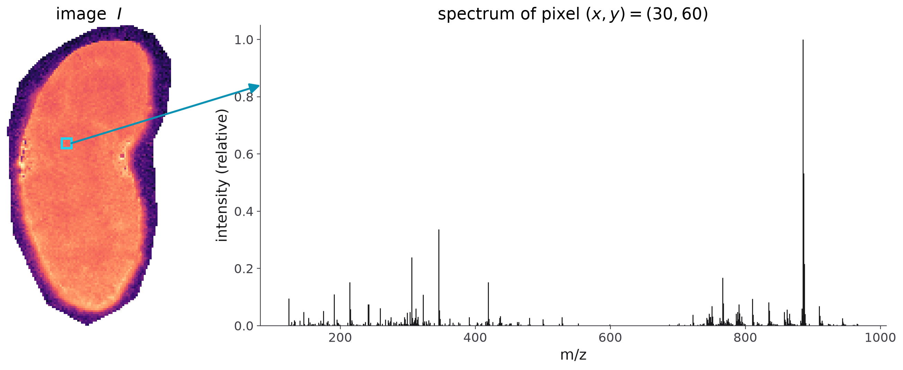{width="100%"}

- every pixel of the image carries a whole mass spectrum
- MALDI: the tissue section is scanned pixel by pixel; one spectrum per position

## Data: mathematical description {.smaller}

[formal]{.slide-group}

:::: {.columns}
::: {.column width="46%"}
**Image** $\quad I \subset \mathbb{N}^{2}$ (or $\mathbb{N}^{3}$), pixel $p = (x, y)$

**Spectrum at $p$** — peaks $(m, v) \in \mathbb{R}_+ \times \mathbb{R}_+$
$$\mu_p = \sum_k v_k\, \delta_{m_k}$$

**Binning** of the m/z axis $[100, 3000]$ with step $0.55$
$$B_i = [\,100 + 0.55(i-1),\ 100 + 0.55\,i\,), \quad i = 1, \dots, M$$
$$x_{p,i} = \sum_{m_k \in B_i} v_k, \qquad M = 5273$$
:::
::: {.column width="54%"}
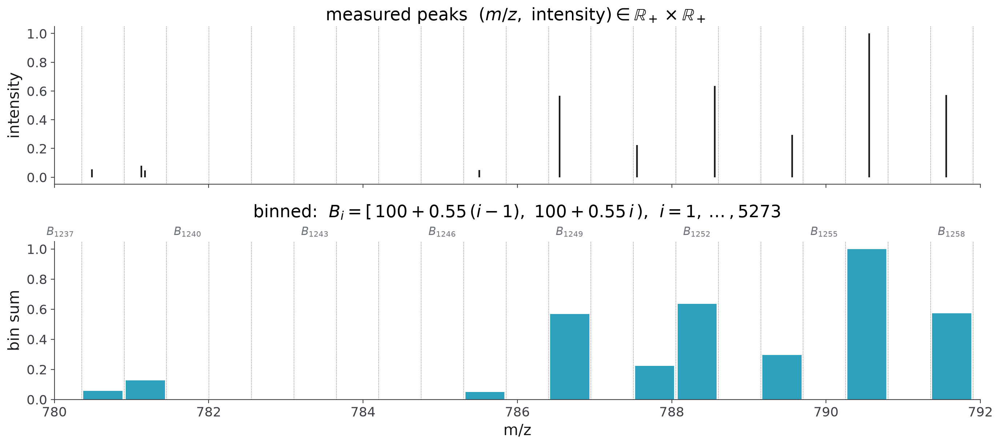{width="100%"}
:::
::::

::: {.formula-box}
$$\text{data} \;\subset\; I \times \prod_{i=1}^{M} \big(B_i \times \mathbb{R}_+\big) \;\cong\; I \times \mathbb{R}_+^{M},
\qquad x_p \mapsto \frac{x_p}{\lVert x_p \rVert_1} \in \Delta^{M-1} \ \ (\text{TIC})$$
:::

## Segmentation: where the word *atlas* comes from {.smaller}

[intuition]{.slide-group}

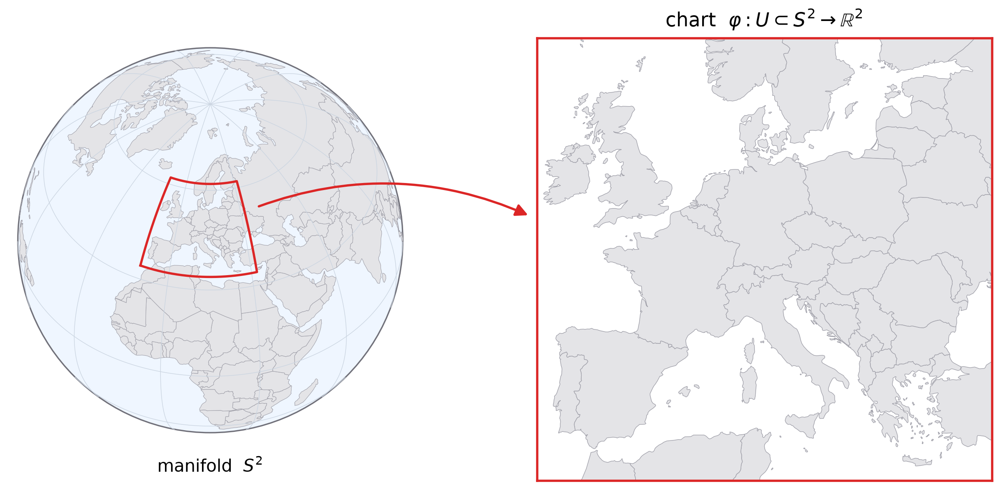{width="92%"}

- the globe is known, but we work with **charts**: approximate, direct representations in $\mathbb{R}^2$
- an **atlas** is a collection of charts $(U_\alpha, \varphi_\alpha)$, $\ \varphi_\alpha : U_\alpha \to \mathbb{R}^d$

## Segmentation: a trivial practical example {.smaller}

:::: {.columns}
::: {.column width="42%"}
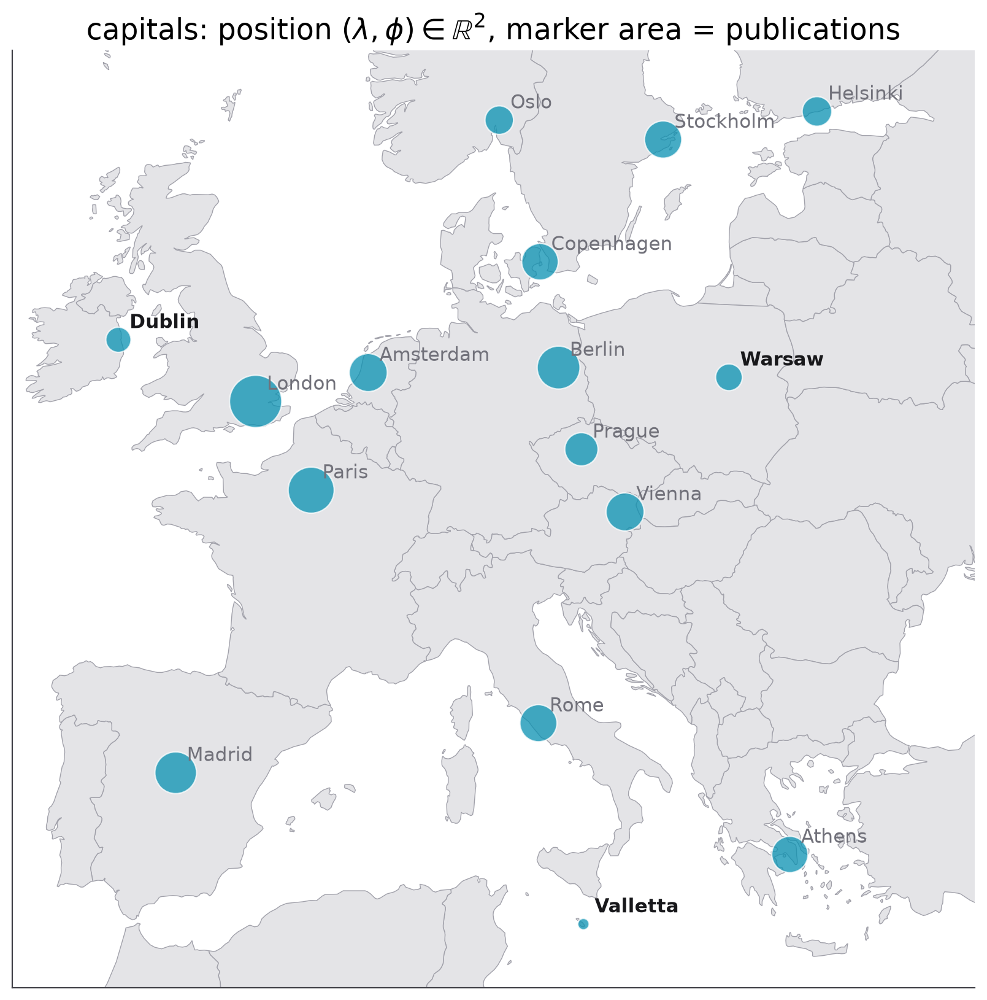{width="100%"}
:::
::: {.column width="58%"}
- a capital needs several coordinates (position, name, country, …)
- we ask **one** question: how active is mass spectrometry there?
- PubMed publications with a capital-city affiliation, normalized over the shown capitals

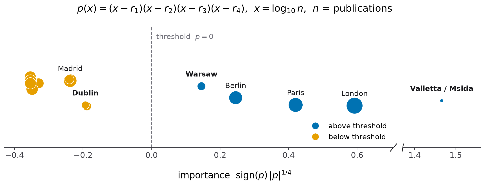{width="100%"}

- representation reduced to $\mathbb{R}$ — two groups appear
:::
::::

[PubMed E-utilities, `"mass spectrometry"[MeSH Terms] AND "<city>"[Affiliation]`, retrieved 2026-09-24.]{.source}

## Segmentation: the analysed example {.smaller}

:::: {.columns}
::: {.column width="58%"}
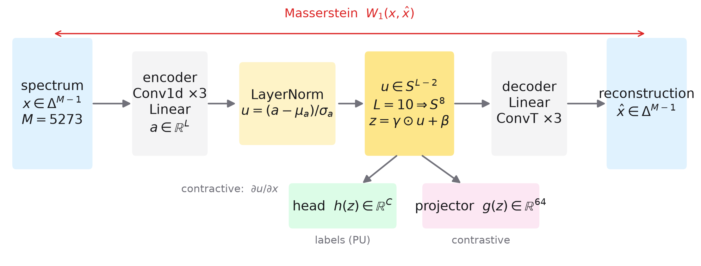{width="100%"}

- encoder compresses a spectrum into a latent point $z$
- decoder reconstructs the spectrum from $z$
- goal: construct $z$ so that it is **stable** and **meaningful**
:::
::: {.column width="42%"}
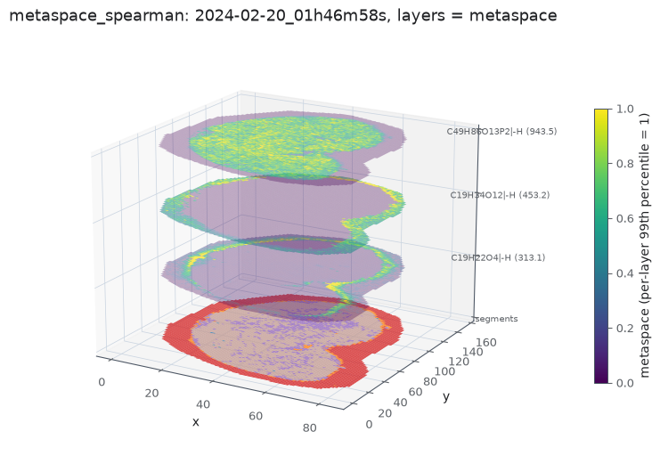{width="100%"}
:::
::::

## Segmentation: the atlas, formally {.smaller}

[formal]{.slide-group}

$$\mathrm{Enc}: \Delta^{M-1} \to S^{L-2}(\sqrt{L}) \subset \mathbf{1}^\perp \subset \mathbb{R}^{L},
\qquad \mathrm{Dec}: \mathbb{R}^{L} \to \Delta^{M-1}$$

:::: {.columns}
::: {.column width="52%"}
**Bottleneck LayerNorm** of $a = \mathrm{CNN}(x) \in \mathbb{R}^L$
$$u = \frac{a - \mu_a \mathbf{1}}{\sigma_a}
\;\Rightarrow\;
\mathbf{1}^\top u = 0, \quad \lVert u \rVert^2 = L$$
so $u$ lies on the sphere $S^{L-2}(\sqrt{L})$ in $\mathbf{1}^\perp$;
$z = \gamma \odot u + \beta$ is an affine image of it.

$L = 10 \;\Rightarrow\; u \in S^{8}$
:::
::: {.column width="48%"}
**Heads on the latent**

- decoder $\hat x = \mathrm{Dec}(z)$
- predictive head $h(z) \in \mathbb{R}^{C}$ (annotated ions)
- projector $g(z) \in \mathbb{R}^{64}$ (contrastive)

**Data inside the sphere**: neighbourhood-based (TwoNN) intrinsic dimension of the
latent points $\approx 5.1$–$5.6$
:::
::::

[TwoNN on the canonical latent of the real-data baseline (axis 100–3000 m/z, 5 repetitions); notebook `part_1_06_latent_geometry`.]{.source}

# Components

## The example we will develop {.smaller}

[toy model]{.slide-group}

:::: {.columns}
::: {.column width="50%"}
- two kidney sections of one series (METASPACE d28-2017-2, d28-2006-2): **16 230 pixels**
- m/z $200$–$950$, step $0.55$: **1364 bins**; **21 annotated ions** (7 shared)
- same architecture and optimizer as the real model, **10 epochs**
:::
::: {.column width="50%"}
- latent $L = 3 \Rightarrow u \in S^{1}$ (a circle), $\;L = 4 \Rightarrow u \in S^{2}$ (a sphere)
- components: **Masserstein**, **predictive head**, **contrastive**, **contractive**
- loss weights as in the real model: head 0.2, contrastive 0.001, contractive 0.002
:::
::::

## The toy latent, interactively {.smaller}

<iframe src="figures/toy_sphere_interactive.html" width="100%" height="780px" style="border:none"></iframe>

● 909.6

● 826.6

● 762.5 + 377.1

● 762.5

● 377.1

● 313.1 only

● none of the five

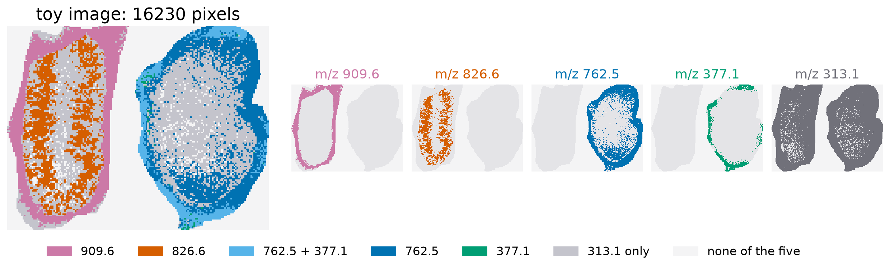{width="100%"}

[**Region key (left):** ● 909.6 · ● 826.6 · ● 762.5 + 377.1 · ● 762.5 · ● 377.1 · ● 313.1 only · ● none of the five. **Ion maps (right):** panel title = m/z; ion-coloured pixels are annotated, grey pixels are not.]{.tiny}

## The toy latent: reconstruction only — $S^1$ {.smaller}

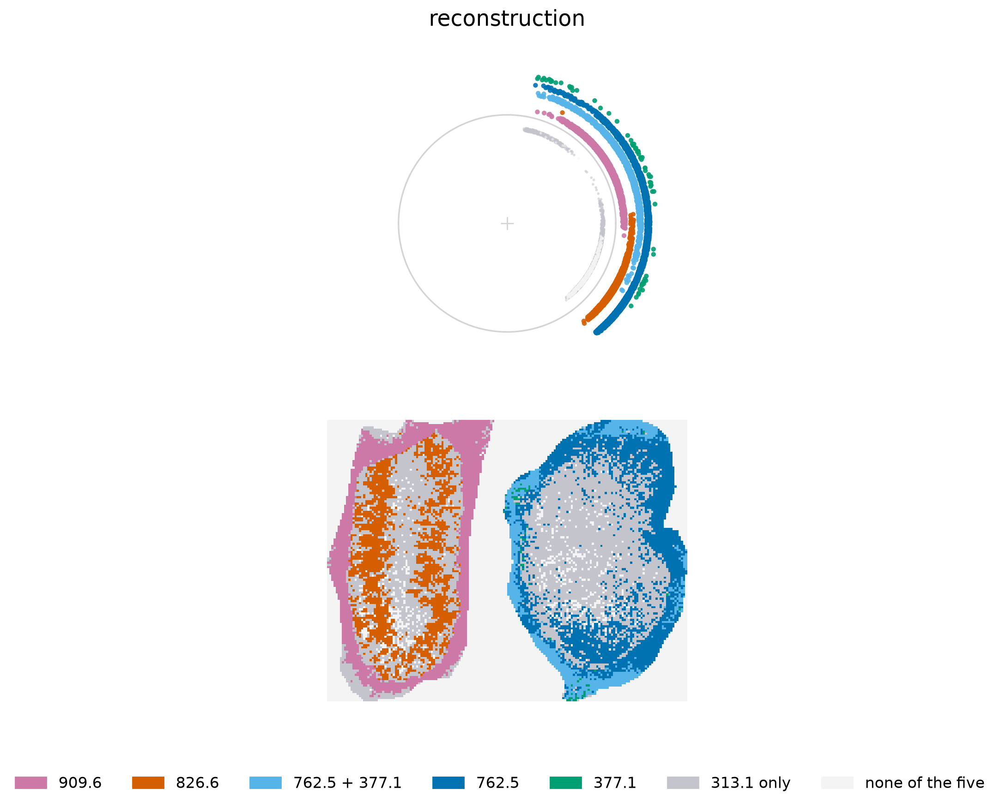{height="780px" fig-align="center"}

[top: every pixel on the circle $S^1$ (small radial jitter for visibility), colour = region; bottom: the image coloured by the position on the circle]{.tiny}

## The toy latent: reconstruction only — $S^2$ {.smaller}

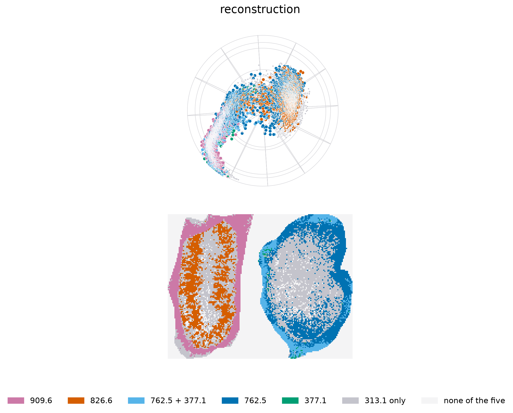{height="780px" fig-align="center"}

[top: every pixel on $S^2$, colour = region; bottom: the image coloured by the position on the sphere]{.tiny}

## Predictive head — $S^1$ {.smaller}

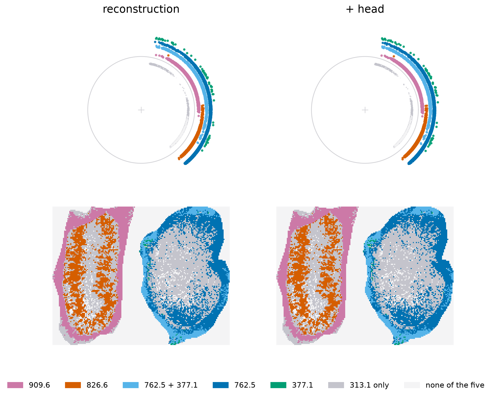{height="800px" fig-align="center"}

## Predictive head — $S^2$ {.smaller}

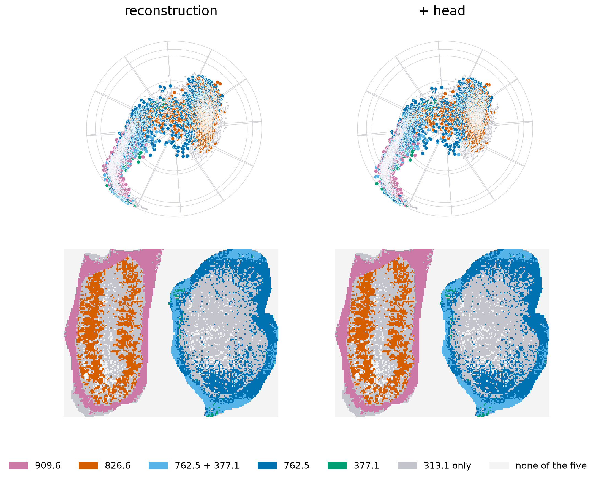{height="800px" fig-align="center"}

## Predictive head: where the ions are {.smaller}

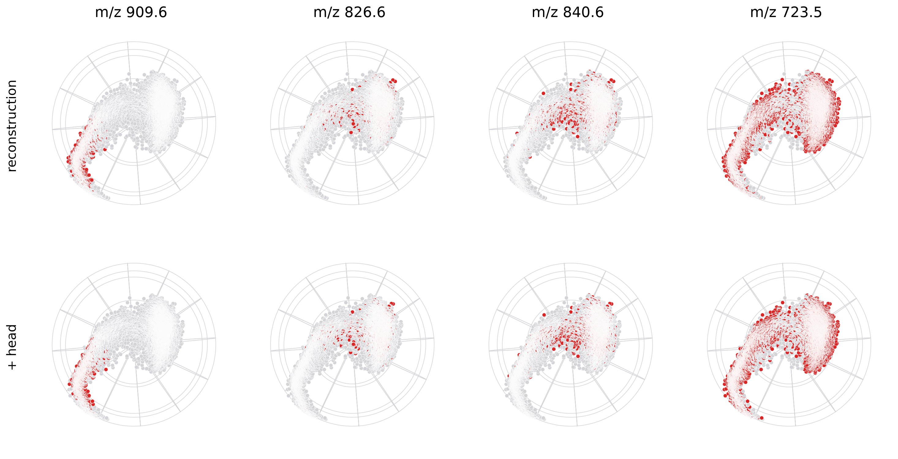{width="92%" fig-align="center"}

::: {.small}
$\mathcal{L}_{\mathrm{VPU}} = \frac{1}{C}\sum_{c}\Big[\log \tfrac{1}{|P \cup U|}\sum_{i} \sigma(h_c(z_i)) - \tfrac{1}{|P_c|}\sum_{i \in P_c} \log \sigma(h_c(z_i))\Big]$
— positive–unlabelled: an unannotated ion is *unknown*, not absent
:::

## Contrastive learning — $S^1$ {.smaller}

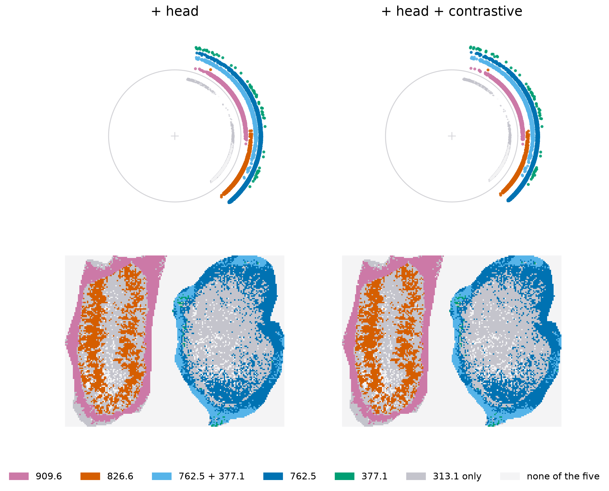{height="800px" fig-align="center"}

## Contrastive learning — $S^2$ {.smaller}

{height="800px" fig-align="center"}

## Contrastive learning: invariance to peak permutations {.smaller}

:::: {.columns}
::: {.column width="50%"}
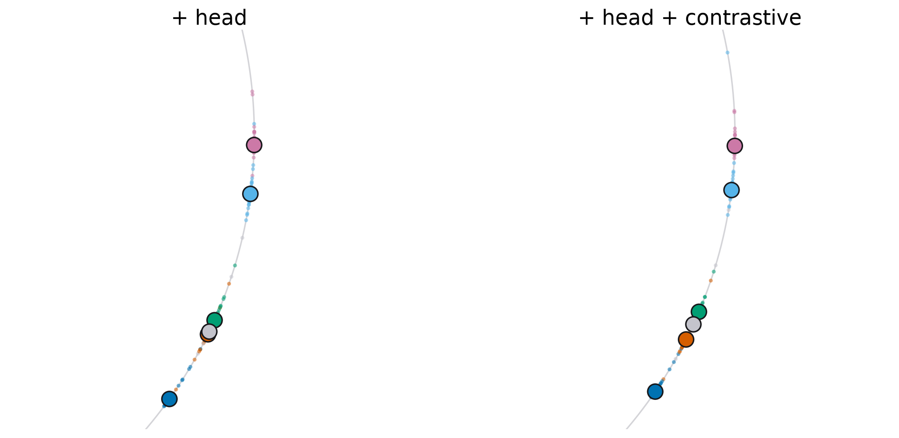{width="100%"}
:::
::: {.column width="50%"}
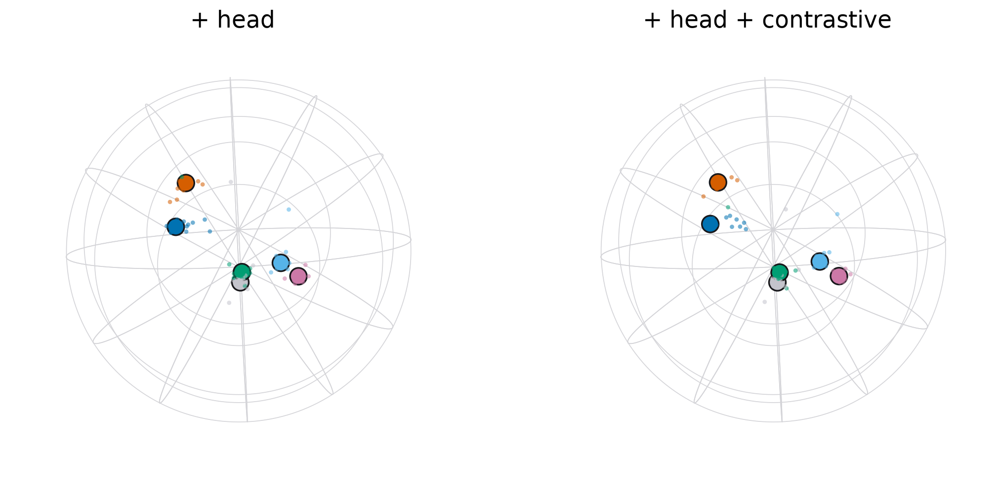{width="100%"}
:::
::::

- a **view** $\tilde x$ permutes the shapes of three unannotated peak envelopes of $x$ (TIC preserved)
- large points: pixels; small points: their views — the tighter the cloud, the more invariant the encoder

## Contrastive learning: formally {.smaller}

[formal]{.slide-group}

For a batch $x_1, \dots, x_B$ and views $\tilde x_i = T(x_i)$, projections
$g_i = g(\mathrm{Enc}(x_i))$, $g_{B+i} = g(\mathrm{Enc}(\tilde x_i))$:

::: {.formula-box}
$$\mathcal{L}_{\mathrm{NCE}} = -\frac{1}{2B}\sum_{i=1}^{2B}
\log \frac{\exp\big(\mathrm{sim}(g_i, g_{\pi(i)})/\tau\big)}{\sum_{j \ne i} \exp\big(\mathrm{sim}(g_i, g_j)/\tau\big)},
\qquad \mathrm{sim}(a, b) = \frac{a^\top b}{\lVert a \rVert \lVert b \rVert},\ \ \tau = 0.07$$
:::

- $\pi(i)$: the other view of the same spectrum (positive pair); every other spectrum is a negative
- numerator **pulls** the two views together, denominator **pushes** different spectra apart
- $T$: cyclic permutation of peak-envelope shapes, **only peaks without annotation**
  — the representation may ignore unannotated rearrangements, but not the annotated evidence
- the loss acts on the projection $g(z)$, the latent $z$ is shaped only through the gradient

## Contractive learning — $S^1$ {.smaller}

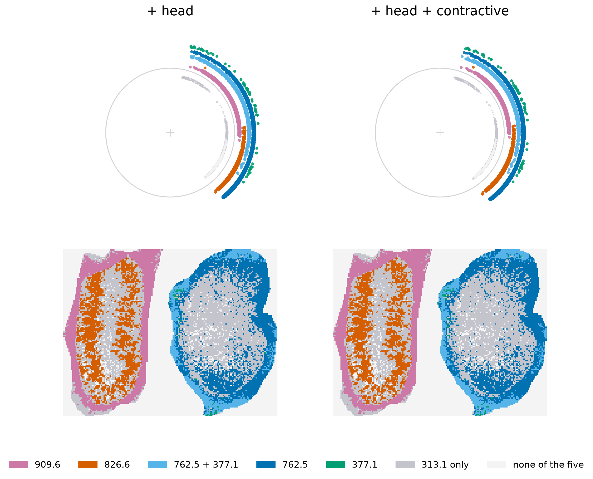{height="800px" fig-align="center"}

## Contractive learning — $S^2$ {.smaller}

{height="800px" fig-align="center"}

## Contractive learning: sensitivity — $S^1$ {.smaller}

:::: {.columns}
::: {.column width="48%"}
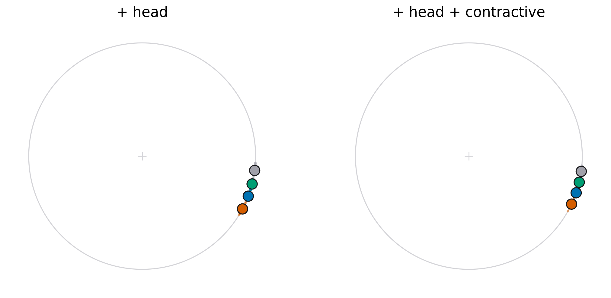{width="100%"}
[large points = pixels, small points = copies perturbed by $d_{FR} = 0.6$]{.tiny}
:::
::: {.column width="52%"}
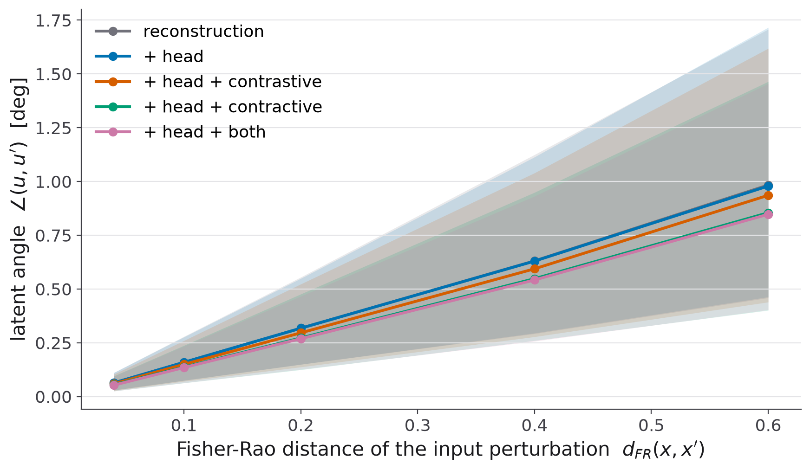{width="100%"}
[median rotation of the latent point (band: interquartile range) against the size of the input perturbation]{.tiny}
:::
::::

- every input spectrum is moved by a fixed Fisher–Rao distance in random directions
- the rotation of its latent point measures the local sensitivity — lower = more stable

[$S^1$ toy trained on one section (854 pixels); the other toy figures use two sections.]{.source}

## Contractive learning: sensitivity — $S^2$ {.smaller}

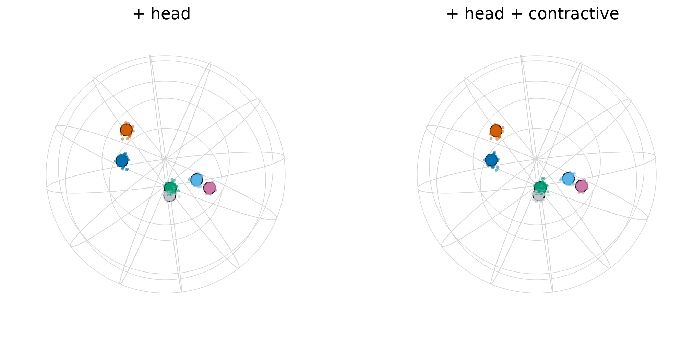{height="620px" fig-align="center"}

- large points: pixels; small points: copies perturbed by the same Fisher–Rao distance
- the tighter the cloud, the more stable the encoder

## Contractive learning: formally {.smaller}

[formal]{.slide-group}

:::: {.columns}
::: {.column width="50%"}
**Local sensitivity** of the canonical latent: $J_u(x) = \partial u / \partial x \in \mathbb{R}^{L \times M}$

With $z = \gamma \odot u + \beta$:
$$J_z = \operatorname{diag}(\gamma)\,\tfrac{1}{\sigma_a}\,P\,A_x,
\quad P = I - \tfrac{1}{L}\mathbf{1}\mathbf{1}^\top - \tfrac{1}{L}uu^\top$$
$\lVert J_z \rVert$ can be reduced by shrinking $\gamma$ without changing the encoder
$\Rightarrow$ we penalize $J_u$.
:::
::: {.column width="50%"}
**Geometry of the input**: spectra are points of the simplex; its natural metric is
Fisher–Rao,
$$\langle v, w \rangle_x = \sum_i \frac{v_i w_i}{x_i}, \qquad
d_{FR}(x, x') = 2 \arccos \sum_i \sqrt{x_i x'_i}$$
:::
::::

::: {.formula-box}
$$A_x = J_u(x)\,\operatorname{diag}(\sqrt{x})\,\big(I - \sqrt{x}\sqrt{x}^{\top}\big), \qquad
\mathcal{L}_{\mathrm{contr}} = \sigma_{\max}(A_x)^2 + \alpha\,\big[\sigma_{\max}(A_x) - \tau\big]_+^2$$
:::

[$\sigma_{\max}$ by power iteration; $\alpha = 2$, $\tau = 7$. Rifai et al. (2011) ICML — Frobenius, Euclidean, unnormalized latent.]{.tiny}

## Both regularizers — $S^1$ {.smaller}

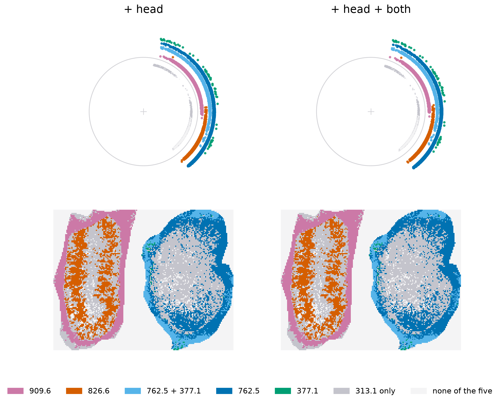{height="800px" fig-align="center"}

## Both regularizers — $S^2$ {.smaller}

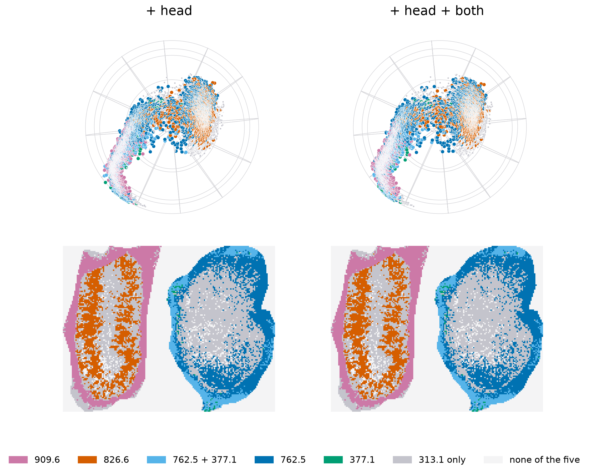{height="800px" fig-align="center"}

## Both regularizers: stability and invariance — $S^1$ {.smaller}

:::: {.columns}
::: {.column width="50%"}
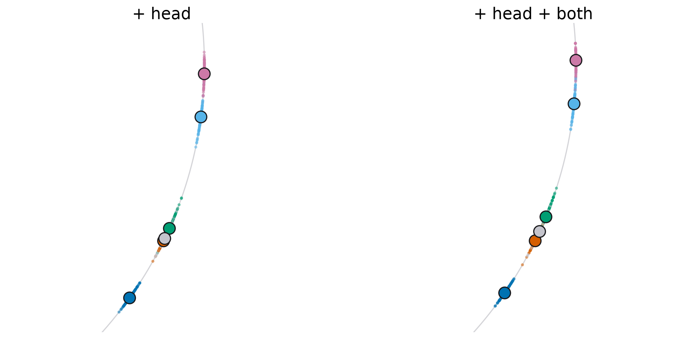{width="100%"}
[input perturbed by $d_{FR} = 0.6$ (contractive view)]{.tiny}
:::
::: {.column width="50%"}
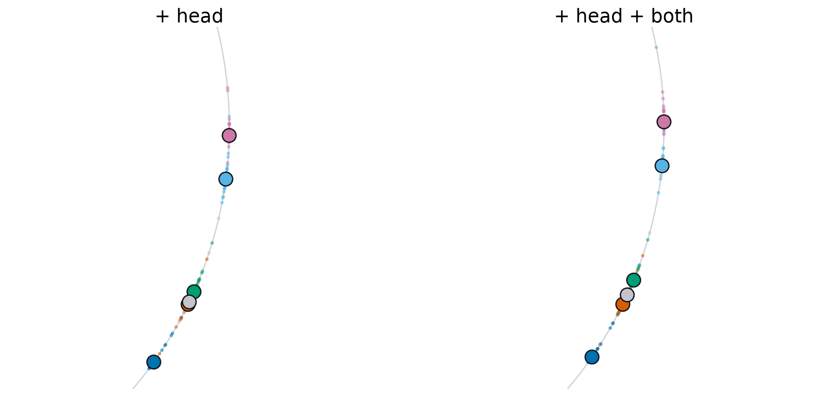{width="100%"}
[unannotated peaks permuted (contrastive view)]{.tiny}
:::
::::

- large points: pixels; small points: perturbed copies (left) or permuted views (right)
- the tighter the cloud, the more stable (left) or invariant (right) the encoder

## Both regularizers: stability and invariance — $S^2$ {.smaller}

:::: {.columns}
::: {.column width="50%"}
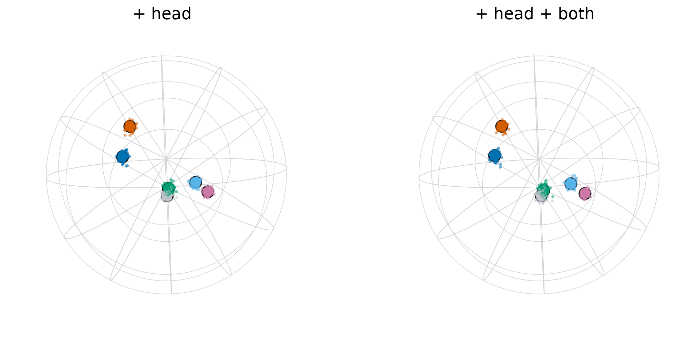{width="100%"}
[input perturbed by $d_{FR} = 0.6$ (contractive view)]{.tiny}
:::
::: {.column width="50%"}
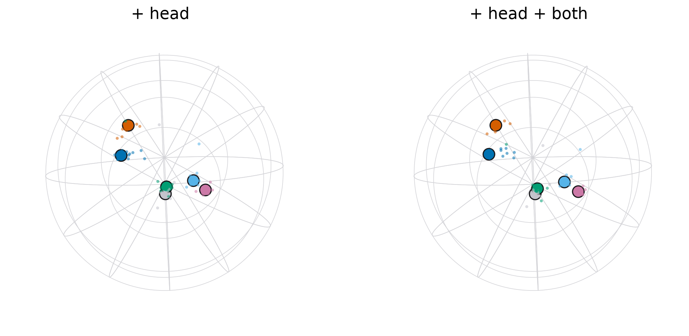{width="100%"}
[unannotated peaks permuted (contrastive view)]{.tiny}
:::
::::

- large points: pixels; small points: perturbed copies (left) or permuted views (right)
- the tighter the cloud, the more stable (left) or invariant (right) the encoder

# Current state

## Current state of the work {.smaller}

- representation model with predictive heads (variational PU) — prepared
- contrastive and contractive regularization — implemented and analysed
- synthetic pretraining — in progress
- next: dataset request and analysis on the benchmark dataset used by msiPL

[msiPL: Abdelmoula et al. (2021) Nat. Commun. 12, 5544, doi:10.1038/s41467-021-25744-8]{.source}

## Masserstein: comparing spectra {.smaller}

:::: {.columns}
::: {.column width="40%"}
TIC-normalized spectra are probability measures on the m/z axis. We compare them by the
**Wasserstein distance** — the cost of moving intensity along m/z.

In one dimension it is exact and linear-time:
$$W_1(x, \hat x) = \int \big| F_x(m) - F_{\hat x}(m) \big|\, dm$$
$$= \sum_{i=1}^{M-1} \Big| \sum_{j \le i} (x_j - \hat x_j) \Big| \,(m_{i+1} - m_i)$$

- no transport matrix, no iterative solver: $O(M)$
- a shifted peak costs its shift, not a full mismatch
:::
::: {.column width="60%"}
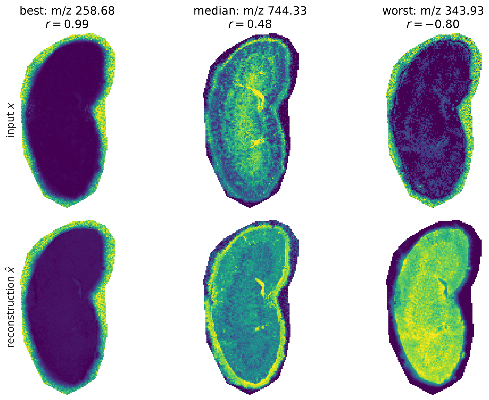{width="100%"}
[real model, held-out image: best, median and worst reconstructed channel]{.tiny}
:::
::::

[Majewski, Ciach, Startek, Niemyska, Miasojedow, Gambin (2018) WABI, doi:10.4230/LIPIcs.WABI.2018.25 · Ciach et al. (2020) Rapid Commun. Mass Spectrom., doi:10.1002/rcm.8956]{.source}

## How much of the latent sphere is occupied? {.smaller}

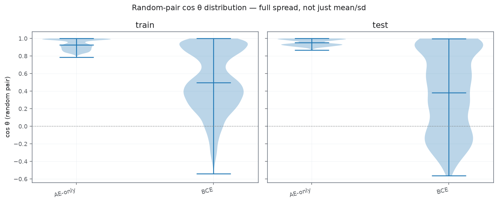{width="100%"}

[Random-pair $\cos\theta$ distributions for train and test. Values near 1 mean two latent directions are close; a broader spread toward 0 or below indicates wider angular coverage of the sphere.]{.tiny}

## Acknowledgements {.center}

- **IsoSpec2** — Łącki, Valkenborg, Startek (2020) *Anal. Chem.*, doi:10.1021/acs.analchem.0c00959
- **Masserstein** and the one-dimensional Wasserstein distance for spectra —
  Majewski, Ciach, Startek et al. (2018); Ciach et al. (2020)
- the organizers of BioGeMT for the opportunity to take part
