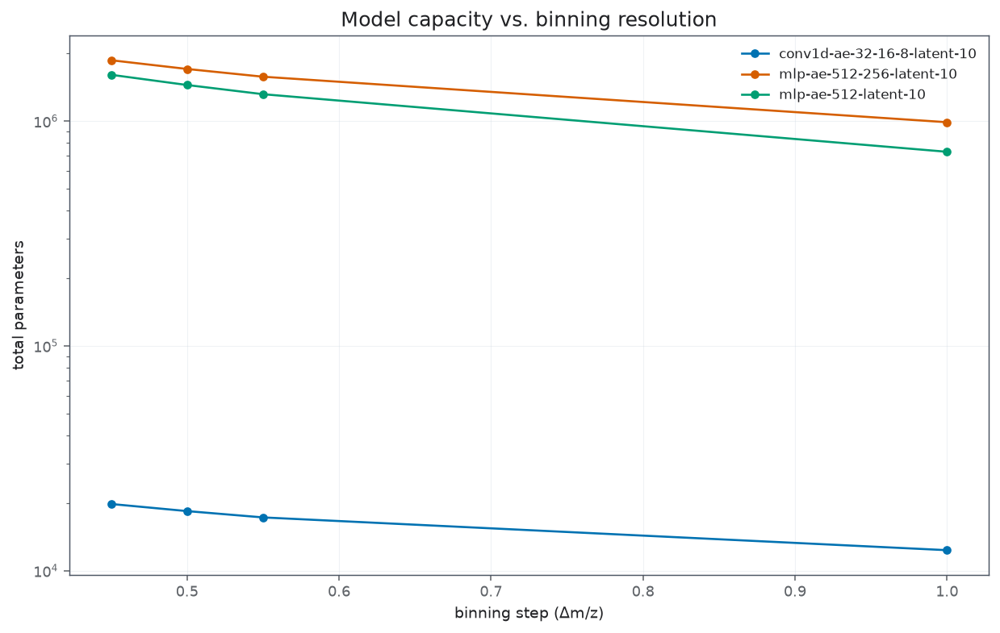
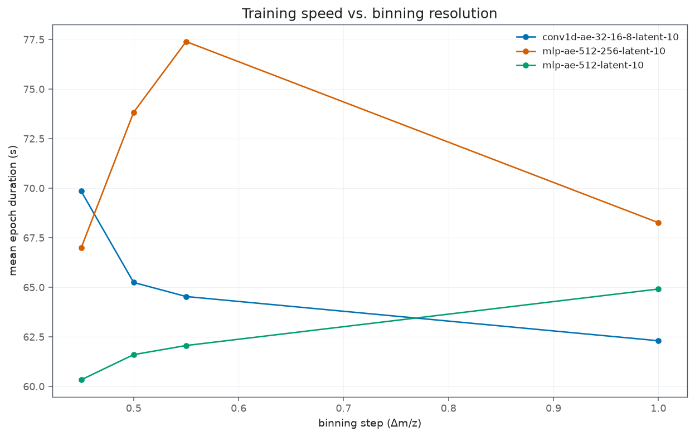
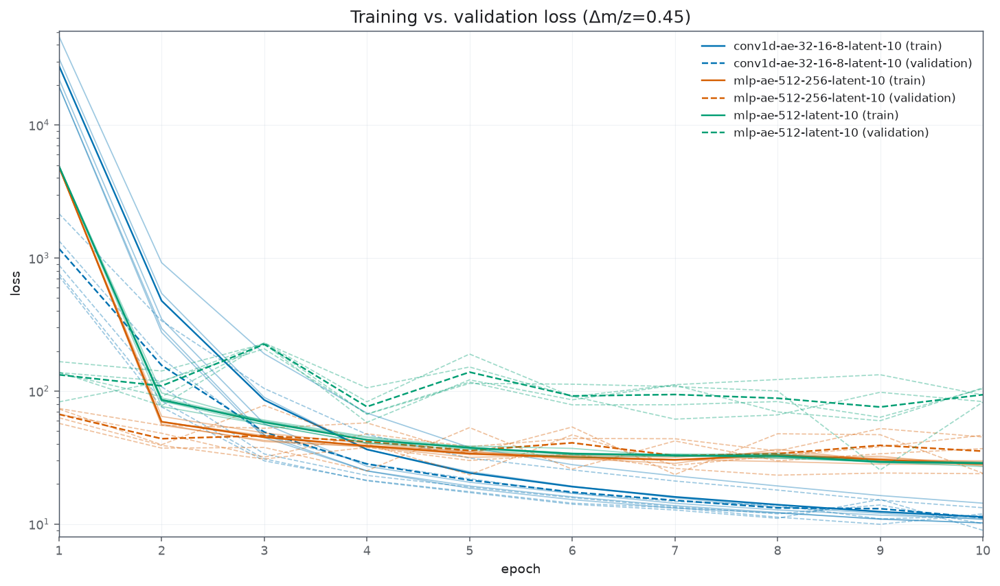
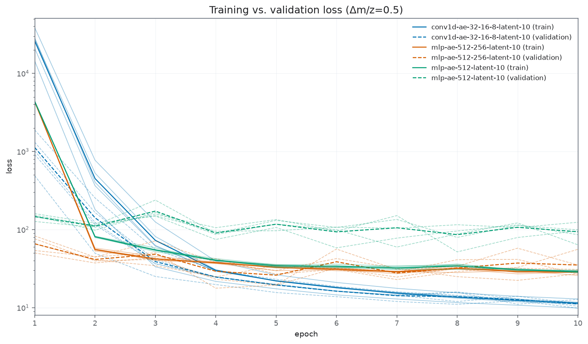
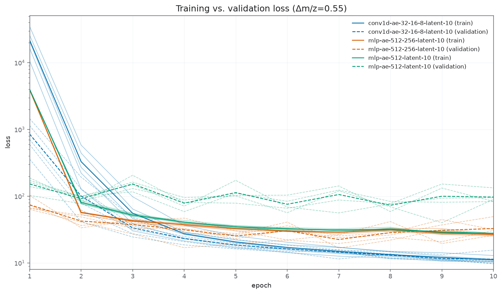
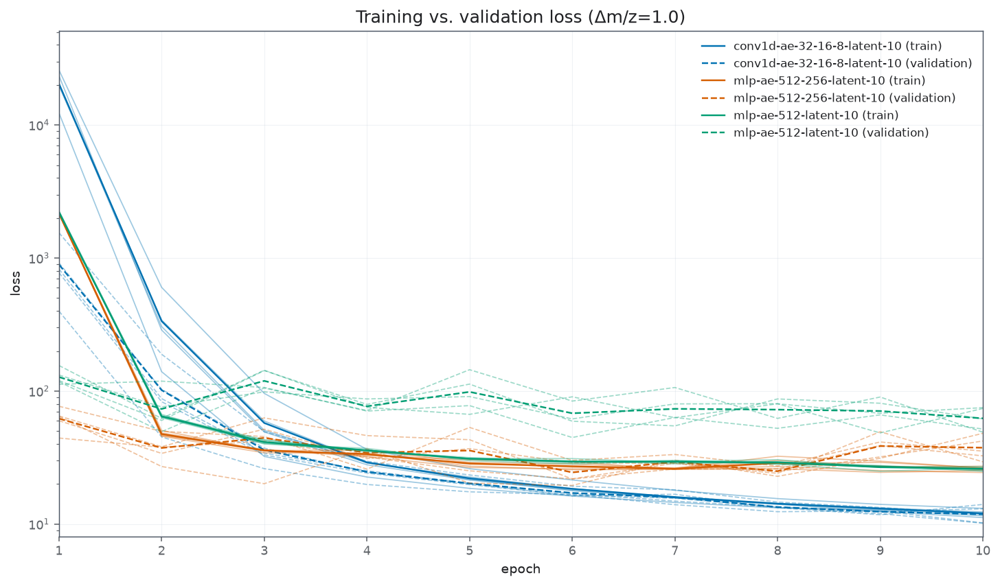
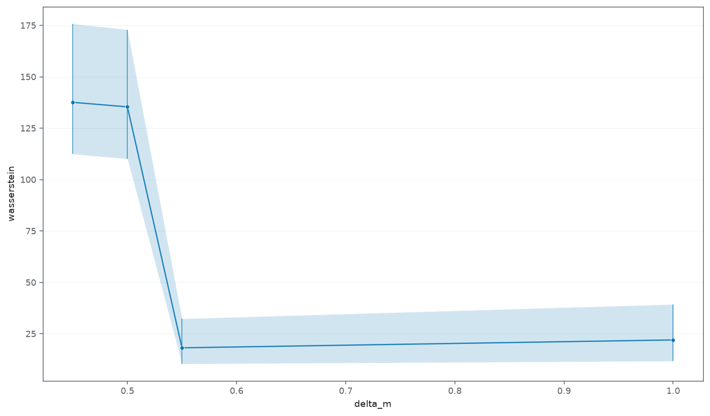

# Końcowy raport - rekonstrukcja 

## Metodologia 

Ostatnio zmniejszyliśmy gęstość binnigu. Umożliwa to sprawdzenie także architektury MLP (Multi Layer Perceptron ...), która w teorii uwzględnia globalne cechy

### Architektury 
Architektury który sprawdziliśmy : 
- jednowarstwową  architekture MLP (wymiar: 512)
- dwuwarstwową architekture MLP (wymiar: 512 x 256) 
- siec konwolucyjną wymiary:
  - channels: [1, 32, 16, 8]
  - kernels: [7, 5, 3]
  - strides: [3, 3, 3]

Dla wszyskich sieci rozmiar latentu wynosił 10. 

### Binning 
Binning który sprwadziłem: 
- 0.45
- 0.5
- 0.55
- 1. 

Pierwsze trzy miały sprawdzić czy dodatkowe rozróżnienie (jeżeli tak to jak gęste), pomoże w uczeniu modelu.

Ostatni jest **najmniejszym** rozmiarem binnu jaki możemy zastosować.

> Uwaga:
> Ważne jest tutaj założenie, że technologia MALDI ma rozdzielość 1 m/z, przesunięcia w osi wynikają z drobnych różnic mas molekularnych, oraz stanu fizykochemicznego jonu. 

### Dane 
Zrobiłem losowy dobór pixeli z 10 % próbki ($\approx 3 \mathrm{gb}$). Tkanką była nerka. Uwaga, na tym etpaie **nie normalizowałem** danych ze względu na analizator, nie ma to tutaj znaczenia, ponieważ on wpływa tylko na położenei cząsteczek na widmie - będzie to miało wpływ podczas annotacji. 

Wszystkie kombinacje modeli były uruchomione 5 razy. 

***

## Wyniki

### Ogólnie 

#### Dopasownie widma 
Otrzymujemy dokładność na poziomie $\pm 1 \mathrm{Da}$, plus ewentuanlie szum. 

Wyszło to troche gorzej niż ostatnio (dopasowanie widm). Wynika to z tego że przestrzeń jest mniejsza, mamy mniej złożone modele oraz, że błąd był sztucznie **zaniżony**. Uśredniałem go po batchach itd. a przez to że wymiar był duży to wyniki wychodziły małe. Nie robiłem dokąniejszej analizy ale też pewin były mismatche o kilka pixeli.\

#### Najlepszy model
Najlepszym modelem sie okazuje siec konwolucyjna **ale** dopiero na binnigu $0.55, 1.0$. 

*** 

### Wstępna analiza (wiem - nic to nie mówi) 

#### Złożoność
Sieć konwolucyjna ma 100 razy mniejszą złożność. Jej wadą jest to że nie wychwytuje globalnej informacji. 

Tabela ze złożonością 

<table border="1" class="dataframe">
  <thead>
    <tr style="text-align: right;">
      <th></th>
      <th>architecture</th>
      <th>binning_step</th>
      <th>total_parameters</th>
      <th>mean_epoch_duration</th>
      <th>std_epoch_duration</th>
      <th>mean_total_duration</th>
      <th>epoch_count</th>
    </tr>
  </thead>
  <tbody>
    <tr>
      <th>0</th>
      <td>conv1d-ae-32-16-8-latent-10</td>
      <td>0.45</td>
      <td>19825</td>
      <td>69.850553</td>
      <td>6.209009</td>
      <td>698.505534</td>
      <td>50</td>
    </tr>
    <tr>
      <th>1</th>
      <td>conv1d-ae-32-16-8-latent-10</td>
      <td>0.50</td>
      <td>18433</td>
      <td>65.247411</td>
      <td>2.326418</td>
      <td>652.474106</td>
      <td>50</td>
    </tr>
    <tr>
      <th>2</th>
      <td>conv1d-ae-32-16-8-latent-10</td>
      <td>0.55</td>
      <td>17279</td>
      <td>64.538101</td>
      <td>1.094870</td>
      <td>645.381005</td>
      <td>50</td>
    </tr>
    <tr>
      <th>3</th>
      <td>conv1d-ae-32-16-8-latent-10</td>
      <td>1.00</td>
      <td>12353</td>
      <td>62.307517</td>
      <td>0.641353</td>
      <td>623.075168</td>
      <td>50</td>
    </tr>
    <tr>
      <th>4</th>
      <td>mlp-ae-512-256-latent-10</td>
      <td>0.45</td>
      <td>1866782</td>
      <td>66.990728</td>
      <td>8.425594</td>
      <td>669.907284</td>
      <td>50</td>
    </tr>
    <tr>
      <th>5</th>
      <td>mlp-ae-512-256-latent-10</td>
      <td>0.50</td>
      <td>1706882</td>
      <td>73.831983</td>
      <td>6.734934</td>
      <td>738.319826</td>
      <td>50</td>
    </tr>
    <tr>
      <th>6</th>
      <td>mlp-ae-512-256-latent-10</td>
      <td>0.55</td>
      <td>1576707</td>
      <td>77.399525</td>
      <td>10.925777</td>
      <td>773.995251</td>
      <td>50</td>
    </tr>
    <tr>
      <th>7</th>
      <td>mlp-ae-512-256-latent-10</td>
      <td>1.00</td>
      <td>989382</td>
      <td>68.265170</td>
      <td>7.547060</td>
      <td>682.651697</td>
      <td>50</td>
    </tr>
    <tr>
      <th>8</th>
      <td>mlp-ae-512-latent-10</td>
      <td>0.45</td>
      <td>1608222</td>
      <td>60.335828</td>
      <td>4.232329</td>
      <td>603.358281</td>
      <td>50</td>
    </tr>
    <tr>
      <th>9</th>
      <td>mlp-ae-512-latent-10</td>
      <td>0.50</td>
      <td>1448322</td>
      <td>61.606467</td>
      <td>1.886089</td>
      <td>616.064668</td>
      <td>50</td>
    </tr>
    <tr>
      <th>10</th>
      <td>mlp-ae-512-latent-10</td>
      <td>0.55</td>
      <td>1318147</td>
      <td>62.066333</td>
      <td>1.133055</td>
      <td>620.663334</td>
      <td>50</td>
    </tr>
    <tr>
      <th>11</th>
      <td>mlp-ae-512-latent-10</td>
      <td>1.00</td>
      <td>730822</td>
      <td>64.916190</td>
      <td>8.322276</td>
      <td>649.161901</td>
      <td>50</td>
    </tr>
  </tbody>
</table>

#### Czas trenowania

Widzimy, że złożoność modelu, **nie wpływa** na długość treningu.

#### Porównanie ogólnej funkcji kosztu

Podczas trenowania zapisywałem modele, które były najlepsze względem **zbioru walidacyjnego**. Na każdym wykresie przyjmujemy:
- ciągła linia: treningowy zbiór
- kreskowana linia: zbiór walidacyjny

##### Overfitting 
Widzimy, że model `MLP-512` bardzo szybko overfittuje, `MLP-512-256` nie overfituuje ale ma większy błąd, najelpiej dopasuje sie `conv`. 

##### Stabilność 
Tutaj było dla mnie ważne, żeby zobaczyć jak binning wpływa na wariancje wartości funkcji straty. Zauważmy że w przypadku binningu $\mathrm{\Delta m\backslash z} = 0.55, \mathrm{\Delta m\backslash z} = 1.0$

***

### Analiza rekonstrukcji widm 

#### Rozkład błędu 

Widzimy, że ogólnie błąd dla $\mathrm{\Delta m\backslash z} = 0.55, \mathrm{\Delta m\backslash z} = 1.0$, rozkład błędu jest znacznie mniejszy.

Dla przypomnienia dolna wartość takiego błędu, idealnie dopasowane widmo, to jest 

**Konwolucyjna sieć**

#TODO - nazwać odpowiednio obrazy 

****

#### Porównanie widm - sieć konwolucyjna 
Tutaj nie zamieszczam zdjęć, ponieważ jest tego za dużo. Zamieszczę moje obserwacje, żęby sobie porównać zdjęcia, proszę zerknąć do notebooka (#TODO - github - link).   

#### Różnica pomiedzy binning'em $\mathrm{\Delta m\backslash z} = 0.50, \mathrm{\Delta m\backslash z} = 0.55$ 
Różnica polega na tym że dla binningu $\mathrm{\Delta m\backslash z} = 0.55$, siec konwolucyjan **zaczyna** generować obwiednie. 

##### Rozkład m/z
Nie wiem o co chodzi z peakiem na wartości 900. Mam teze, że model **nie potrafił**, dopaswoać całej wartości. Żeby funkcje kosztu zmniejszyć potrzeba mieć **takie same intesywności**, jak tego nie ma to otrzymujemy bardzo dużo błąd (#TODO - policzyć taki przykład) 

Problem znika dla binningu $\mathrm{\Delta m\backslash z} = 0.55, \mathrm{\Delta m\backslash z} = 1.0$, tutaj model umei ZNACZNIE lepiej dopasowac te widam oraz intensywności, nie powtsaje jeden ogólny "śmietnikowy" bin który wszystko zbiera. 

##### Szum 
Zauważmy, że w przypadku sieci konwolucyjnych występuje "szum" (obwiednia) wokół pików. Podejrzewam, że filtry które używamy wykrywają, że w danym otoczeniu latentu peak powinien występować dla pewnego $\mathrm{m\backslash z}$ Nie jest to aż tak straszne, poniweaż symuluje obiwednie i ten bład to jest kilka daltonów. 

Warto zauważyć, że to wpływa na charakteryzacje **najgorzej przewidzianych widm**, błąd jest tam największy ponieważ powstaje w regionach **rzadko rozłożonych peaków** - powstaje obwiednia w ic otozceniu a nic tam nie powinno być. 

##### Treningowe vs testowe 
W treningowych widmach widać mniejsze obwiednie., ale nie ma wyraźnych różnic. 

> Uwaga:
> W notebooku najpierw są testowe potem treningowe zaplotowane 

##### Podsumowanie 
Błąd wynika głównie z **nadmiernego** generowania widm, wynika to z wielkości filtra (ograniczmy go do 3, żeby to otocznie zredukować), lokalizacja peaków jest dobra, błąd wynosi zazwyczaj około $\pm \mathrm{Da}$ 

#### MLP 
Komentuje tutaj wyniki obu architektur na raz

##### Dokładnośc intensywność 
Ten model ma mniejszy problem z dopasowaniem intensywności, jednak 

##### Ubogość widm
Tutaj głównym problemem jest to ze generowane widma są zbyt rzadkie, powoduje to, że widzimy tylko pojedyncze peaki, są one z błędem większym niż $\pm \mathrm{Da}$. 

## Podsumowanie 

### Ostateczny binning
Ostatecznie bym wybrał binning $\mathrm{\Delta m\backslash z} = 1.0$. Jest on najstabilniejszy podczas po treningu  

### Ostateczna architektura - sieć konwolucyjna  
Zdecydowanie lepiej radzi sobie sieć konwolucyjna, ponieważ **nadmierną** ilość widm możemy wyczyścić, w przypadku MLP mamy za mało widm, nie możemy ich sztucznie wygenerować. 

### Propozycje poprawy 

#### Kara do nierówmiernego rozłożenia wartości
Suma wyjściowa ma byc 1 (bo normalizacuej TiC'iem), można wymusic, żeby nie było takeij sytuacji zę dostajem skrajne wartości, wiec można by dodać karę za nierównieminerne rozłożenie tej masy ...., żęby nie bło tak że model wybiera osbie punkt w kórym daje prawie cala masę, poniewaz jest to mniejszy błąd niż w przypadku dopasowania 

#### Centroidowanie widma 

Moglibyśmy zrobić coś takiego, że centoridujemy te rozrzucone widma jakoś (przy decoderze jakąś poprawkę zastosować) - pomysły na to. 