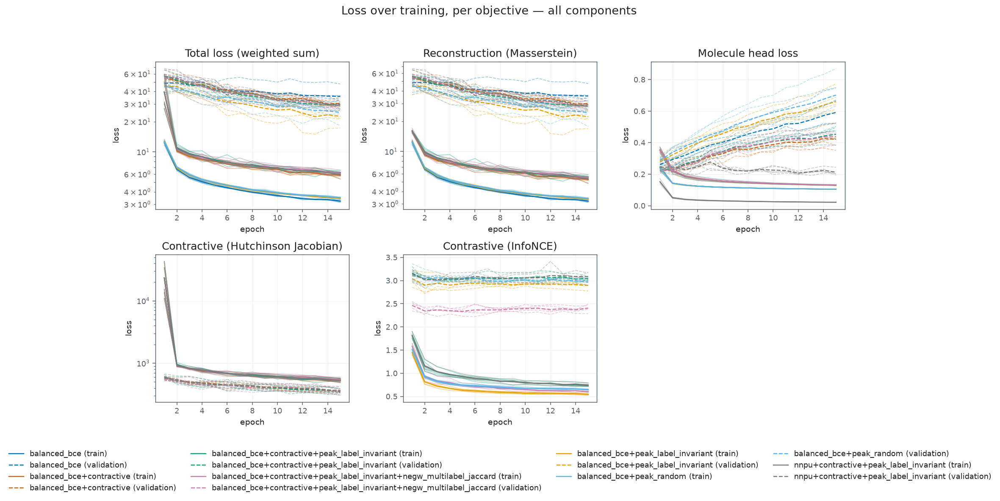
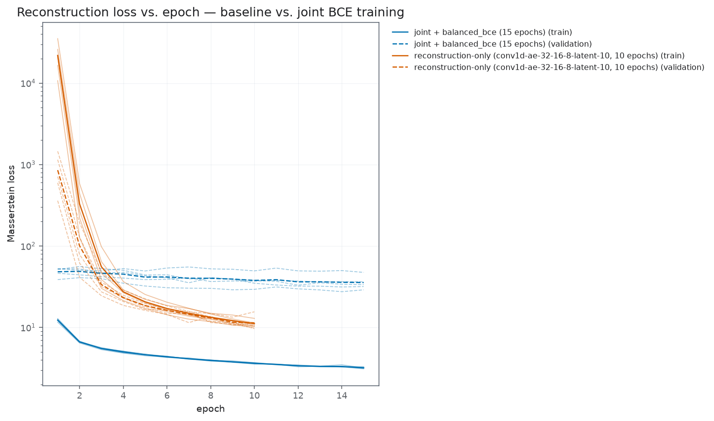
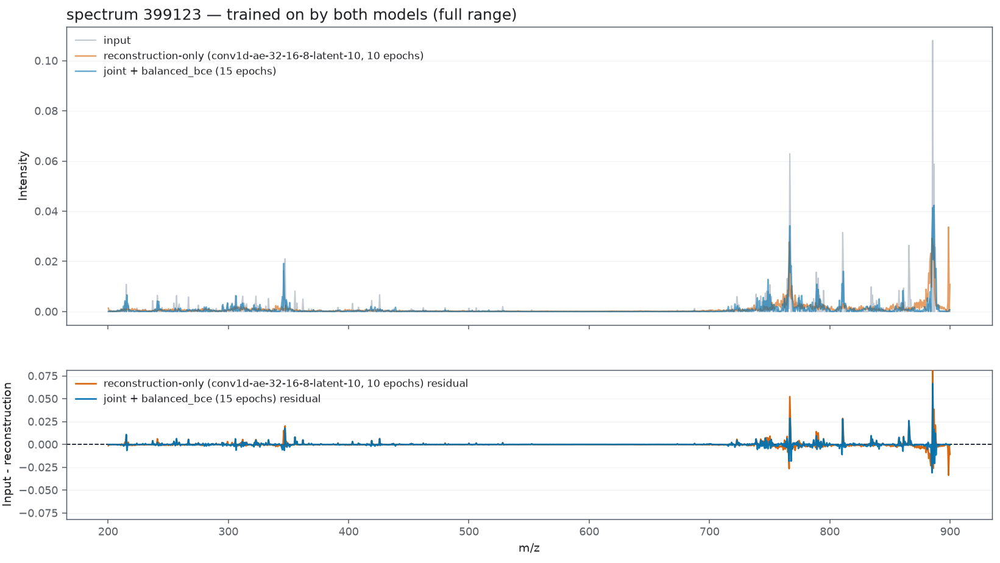
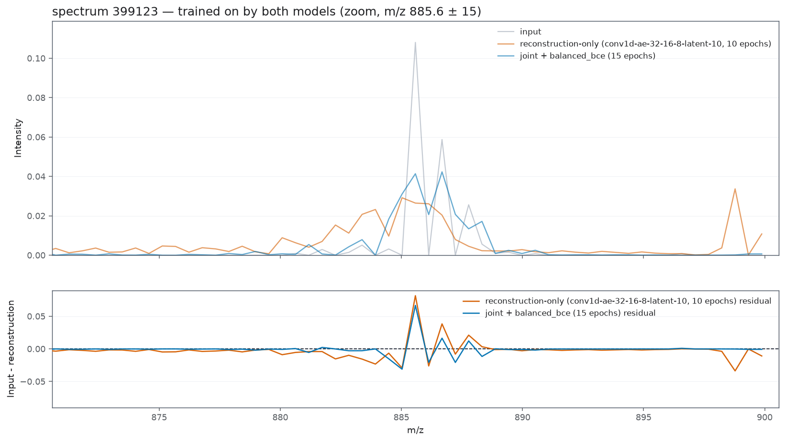
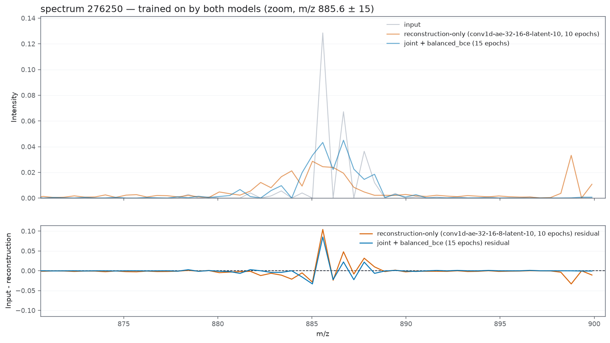
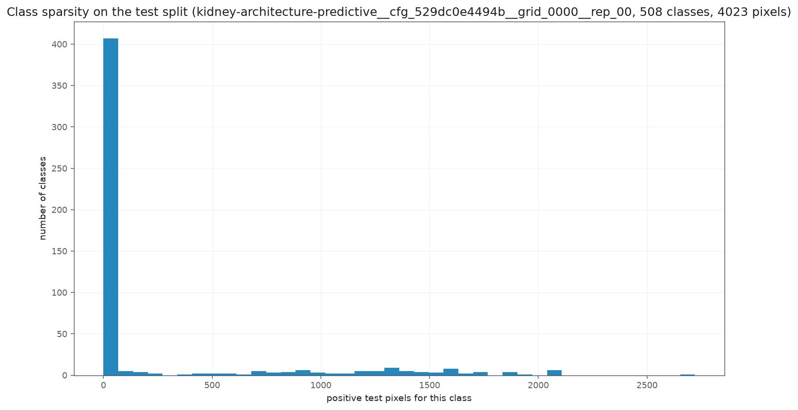

# Końcowy raport - modele predykcyjne 

## Wstęp

### Autorstwo 

Raport jest cały pisany ręcznie. A.I zostało użyte do formatowania tekstu, częściowo wyprowadzania równań (wszystkie są przejrzane ręcznie), oraz do napisania konstrukcji eksperymentu (tylko szarlatan by to pisał ręcznie). 

### Cel 

Celem analizy jest wybranie najlepszej konstrukcji, związanej z modelem predykcyjnym. Porównuje tutaj rózne regularyzacje odnosząc sie do podstaw teoretycznych. 

Celem jest także zrobienie takiego wstepu teoretycznego, żeby Maria baze związaną co było robione. 

### Sugestia
Rzucić okiem na eksperyment, najwazniejsze jest, że:
- wszystkie model miały te same datasety treningowe, wieć nie ma różnicy ze względu na dane 
- architektura użyta do rekonstrukcji to sieć konwolucyjna z binnigiem $\Delta \mathrm{m\backslash z}$. 
- testujemy rózne funkcje kosztu, sprawdzamy 
  - kontraktywność (to mi zajęło większość czasu, ponieważ mamy inny przypadek niz w oryginalnym artykule)  
  - kontrastywność
  - w teorii rzucić okiem na:
    - przestrzeń i że jest to podrozmaitość $S^{8}$ przekształcona przez odwzorowanie afiniczne. 
    - kontraktywność - wnioski z parmaterami i powody pomiaru 
    - nnPU i ogólnie problematyke klas 

## Konstrukcja eksperymentu

### Architektura

Wszystkie $35$ przebiegów używa tych samych czterech komponentów, różniąc się wyłącznie członami
straty nałożonymi na ich wyjścia.

#### Enkoder

Trzy bloki konwolucyjne `Conv1d → LayerNorm → ReLU`, następnie wąskie gardło
`Flatten → Linear → LayerNorm`. Liczba kanałów rośnie, a następnie maleje, natomiast oś widmowa
kurczy się przy każdym kroku:

| etap | operacja | kanały | kernel | stride | szerokość wyjścia |
|---|---|---|---|---|---|
| wejście | — | $1$ | — | — | $1273$ |
| blok 1 | `Conv1d + LayerNorm + ReLU` | $1 \to 32$ | $5$ | $3$ | $423$ |
| blok 2 | `Conv1d + LayerNorm + ReLU` | $32 \to 16$ | $7$ | $3$ | $139$ |
| blok 3 | `Conv1d + LayerNorm + ReLU` | $16 \to 8$ | $3$ | $3$ | $46$ |
| projekcja | `Flatten(8 \times 46 = 368) → Linear(368, 10) → LayerNorm` | — | — | — | $L = 10$ |

Architektura jest analogiczna do analizy rekonstrukcyjnej, przy czym zmieniłem rozmiar pierwszego
i drugiego filtra. Liczba parametrów pozostała ta sama, więc nie wprowadza to dodatkowej
zmienności, a celem było zmniejszenie szumu wynikającego z długości obwiedni.

> Uwaga:
> Wszystkie normalizacje to `LayerNorm`, nie `BatchNorm`. Jest to wymóg kary kontraktywnej:
> przy `BatchNorm` Jakobian $\partial\,\mathrm{enc}(x)/\partial x$ zależałby od pozostałych
> elementów batcha przez statystyki bieżące, więc nie byłby dobrze określony jako pochodna
> funkcji pojedynczej próbki.

#### Dekoder

Odbicie lustrzane enkodera. `Linear → LayerNorm → Reshape` rozwija kod $L$-wymiarowy z powrotem
do kształtu $(8, 46)$, następnie trzy bloki `ConvTranspose1d` w odwrotnej kolejności kanałów
($8 \to 16 \to 32 \to 1$, z tymi samymi kernelami i strideami) odtwarzają szerokość $M = 1273$.
Wartość `output_padding` w każdym bloku jest dobrana tak, żeby szerokość wyjścia zgadzała się
dokładnie z odpowiadającą szerokością wejścia enkodera, więc nie ma przycinania.

Każdy blok poza ostatnim to `ConvTranspose1d → LayerNorm → ReLU`. Ostatni to
`ConvTranspose1d → softplus → normalizacja TIC`, gdzie `softplus` wymusza nieujemne
intensywności, a normalizacja TIC sprowadza rekonstrukcję na tę samą skalę co wejście.

#### Projektor

`Linear(10, 10) → LayerNorm → ReLU → Linear(10, 64)`. Odwzorowuje kod $z$ na osobną projekcję
$g(z)$, używaną wyłącznie przez stratę kontrastywną.

#### Głowa klasyfikacyjna

`Linear(10, 128) → ReLU → Dropout(0.1) → Linear(128, 508)`, działa na $z$. Zwraca surowe logity,
nie prawdopodobieństwa, ponieważ sigmoida i softplus są stosowane wewnątrz implementacji strat
głowy, co daje stabilniejszy numerycznie rachunek.

***

### Badane ablacje

Jedna architektura $\times$ siedem kompozycji straty $\times$ pięć powtórzeń $= 35$ zadań.

$$L = \lambda_{\mathrm{rec}} L_{\mathrm{rec}}
  + \lambda_{\mathrm{cls}} L_{\mathrm{head}}
  + \lambda_{\mathrm{CAE}} L_{\mathrm{contractive}}
  + \lambda_{\mathrm{NCE}} L_{\mathrm{NCE}}$$

| `grid_id` | etykieta | regularyzacja | kontrastywność | strata głowy |
|---|---|---|---|---|
| `grid_0000` | `balanced_bce` | — | — | zbalansowane BCE |
| `grid_0001` | `+contractive` | kontraktywna | — | zbalansowane BCE |
| `grid_0002` | `+peak_random` | — | InfoNCE, permutacja losowa | zbalansowane BCE |
| `grid_0003` | `+peak_label_invariant` | — | InfoNCE, permutacja z ochroną anotacji | zbalansowane BCE |
| `grid_0004` | `+contractive+peak_label_invariant` | kontraktywna | InfoNCE, permutacja z ochroną anotacji | zbalansowane BCE |
| `grid_0005` | `grid_0004+negw_multilabel_jaccard` | kontraktywna | jw. + ważenie negatywów Jaccardem | zbalansowane BCE |
| `grid_0006` | `nnpu+contractive+peak_label_invariant` | kontraktywna | InfoNCE, permutacja z ochroną anotacji | nnPU |

Rekonstrukcja (odległość Massersteina) występuje we wszystkich siedmiu przypadkach.

Kolejność wierszy odpowiada pytaniu "który komponent został dodany": `grid_0000` to minimalna
linia bazowa, `grid_0001` do `grid_0003` dodają do niej dokładnie po jednym komponencie,
`grid_0004` łączy dwa pokazane osobno w `grid_0001` i `grid_0003`, `grid_0005` modyfikuje jego
człon kontrastywny, a `grid_0006` powtarza kompozycję `grid_0004` z podmienioną stratą głowy.

Wagi członów są stałe we wszystkich ablacjach:

$$\lambda_{\mathrm{rec}} = 1.0, \qquad
\lambda_{\mathrm{cls}} = 0.2, \qquad
\lambda_{\mathrm{CAE}} = 0.001, \qquad
\lambda_{\mathrm{NCE}} = 0.1$$

> Uwaga:
> Wagi nie były strojone per komponent, więc zmierzony efekt każdego z nich jest warunkowy
> względem tego konkretnego zestawu.

***

### Dane

Tkanką była nerka. Wykorzystałem losowy podzbiór $10\%$ pikseli ($\approx 3\,\mathrm{GB}$),
dobrany warstwowo z ziarnem $42$, przed podziałem na zbiory.

**Wejście.** Widmo $x \in \mathbb{R}^{M}$, $M = 1273$ binów. Binowanie liniowe
$\Delta m/z = 0.55$ w zakresie $[200, 900]$, agregacja przez sumowanie, normalizacja TIC:

$$\tilde{I} = \frac{I}{\sum I + \varepsilon}$$

**Etykiety.** Wielo-etykietowy cel $y \in \{0,1\}^{C}$, $C = 508$ klas molekuła/addukt,
z anotacji METASPACE odwzorowanych na tę samą oś binów co $x$. Piksele bez zachowanej anotacji
są usuwane przed podziałem.

**Podział.** Grupowy po `dataset_id`, w proporcjach $0.8 / 0.1 / 0.1$. Przypisywane są całe
zbiory źródłowe, nie pojedyncze piksele, co zapobiega wyciekowi między sąsiadującymi pikselami.

> Uwaga:
> Na tym etapie **nie normalizowałem** danych ze względu na analizator. Nie ma to tutaj
> znaczenia, ponieważ analizator wpływa wyłącznie na położenie cząsteczek na widmie, co ma
> znaczenie dopiero na etapie anotacji.

> Uwaga:
> Ustawienia danych i podziału są identyczne z analizą rekonstrukcji.

> Uwaga:
> Stosuje oddzielnie zbiór testowy i walidacyjny, **ponieważ checkpointy są liczone względem zbioru walidacyjnego**, zatem nie jest to zbiór niewidoczny podczas treningu. 

***

### Protokół treningowy

Jedna wspólna faza, wszystkie cztery człony optymalizowane łącznie, bez rozgrzewki ani
osobnego dostrajania.

| parametr | wartość |
|---|---|
| epoki | $15$ |
| rozmiar batcha | $64$ |
| optymalizator | AdamW, $\mathrm{lr} = 10^{-3}$, weight decay $10^{-4}$ |
| przycinanie gradientu | norma $5.0$ |
| wczesne zatrzymanie | cierpliwość $10$ |
| checkpoint | przywrócenie najlepszego wyniku walidacyjnego |
| powtórzenia | $5$ |

Wczesne zatrzymanie nie zadziałało w żadnym z $35$ przebiegów, każdy wykonał pełne $15$ epok.

Powtórzenie $r$ używa tych samych pochodnych ziaren podziału, kolejności danych i inicjalizacji
we wszystkich siedmiu ablacjach, więc porównywane pary różnią się wyłącznie kompozycją straty.

***

## Teoria 
W tej części opisuje teorie która sugeruje nam pewne wyniki. Jeżeli jakies wyniki są nie zrozumiałe tutaj znajdą się odpowiedzi. 

Zachęcałbym to przeczytania punktów (#TODO - ttuaj wstawić odnośniki do tego że to ejst sfera, oraz do tyhc wstepów z podstawoych problemów. ), ponieważ na ich podstawie można zrozumieć wiekszość problematyki. Do pozostałych punktów, są odnośniki w odpowiednim miejscu analizy i są zestawione wnioski. 

### Notacja

| symbol | znaczenie |
|---|---|
| $x \in \mathbb{R}^{M}$ | widmo wejściowe, $M = 1273$ |
| $a \in \mathbb{R}^{L}$ | wyjście `Linear(368, L)`, przed normalizacją |
| $u \in \mathbb{R}^{L}$ | wyjście LayerNormu przed transformacją afiniczną |
| $z = \gamma \odot u + \beta$ | reprezentacja w przestrzeni ukrytej (wyjście enkodera) |
| $\mathbf{1}$ | wektor jedynek w $\mathbb{R}^L$ |
| $A_x = \partial a / \partial x$ | Jakobian części enkodera przed normalizacją |
| $J(x) = \partial z / \partial x$ | Jakobian całego enkodera |
| $g(z) \in \mathbb{R}^{64}$ | wyjście projektora, używane wyłącznie przez stratę kontrastywną |
| $P = I - \tfrac{1}{L}\mathbf{1}\mathbf{1}^\top - \tfrac{1}{L}uu^\top$ | rzut na przestrzeń styczną do $M$ |

Dodatkowe założenia: 
- $10^{-8}=\varepsilon \ll \sigma^2$ (będziemy to później pomijać).

***

### Motywacje teoretyczne - trening

#### Charakteryzacja przestrzeni
Ostatecznie będziemy pracować na elipsoidzie ($L-2$)-wymiarowej, zanurzonej w ($L-1$) wymiarowej podprzestrzeni afinicznej.  

$$\boxed{\;M \;\cong\; S^{L-2}\big(\sqrt{L}\big) \subset \mathbb{R}^{L-1}\;}$$

Poniżej wytłumaczenie.

> Uwaga:
> Jest to przeliczone ponieważ się nad tym wcześniej nie zastanawiałem a to jest ważny fragment 

##### Przekształcenia wynikające z architektury 
W architekturze po $\mathrm{CNN}$, jest ustawiona warstwa liniowa `Linear(368, L)`, którą następnie:
1. normalizujemy po warstwie (`LayerNorm`) 
$$\mu = \frac{1}{L}\sum_{i=1}^{L}a_i, \qquad \sigma^2 = \frac{1}{L}\sum_{i=1}^{L}(a_i - \mu)^2, \qquad u_i = \frac{a_i - \mu}{\sigma}$$
2. przenosimy poprzez odwzorowanie liniowe 
$$z = \gamma \odot u + \beta$$

##### Podprzestrzeń afiniczna (normalizacja po warstwie)
Z 1. otrzymujemy, że $u$ znajduje się na hiperpłaszczyźnie  
$$\mathbf{1}^T \cdot u = \underbrace{\sum_{i=1}^L u_i}_{\text{Uwaga 1.1}} = \frac{\sum_{i=1}^L (a_i - \mu)}{\sqrt{\sigma^2 + \varepsilon}} = \frac{\sum_{i=1}^L (a_i) - \overbrace{L \cdot \mu}^{=\sum_{i=1}^L a_i}}{\sqrt{\sigma^2 + \varepsilon}} = 0$$

> Uwaga 1.1:
> Zauważmy że jest to przestrzeń afiniczna, można to potwierdzić poprzez PCA które powinno miec wymiar 9.

Sprawdzając norme $u$: 
$$\lVert u \lVert^2 = \sum_{i=1}^D (u_i)^2 =  \frac{\overbrace{ \sum_{i=1}^D(a_i - \mu)^2}^{= D \sigma^2 }}{\sigma^2 + \varepsilon} = \frac{D \sigma^2}{\sigma^2 + \varepsilon} \xrightarrow{\varepsilon -> 0} \frac{D \sigma^2}{\sigma^2} = D$$
Otrzymujemy ostatecznie, że nasza podrozmaitość jest postaci

$$M = \{\,u \in \mathbb{R}^L \;:\; \mathbf{1}^\top u = 0,\;\; \|u\|^2 = L \,\}$$

co jest definicją sfery $L-2$ wymiarowej zanurzonej w przestrzeni afinicznej ${L-1}$-wymiarowej:

$$\boxed{\;M \;\cong\; S^{L-2}\big(\sqrt{D}\big) \subset \mathbb{R}^{D-1}\;}$$

<!-- ##### Wymiar $M$  

Ja wiem ze to jest intuicyjnie oczywiste, ale nigdy się nie zastanawiałem nad tym jak to się wykazuje 

... -> można te tweirdzenia rozpisac z czego to wynika 

-->

##### Przekształcenie na elipsoide
Nastepnie przenosimy elementy $u \in S^{L-2}$,  przez odwzorowanie afiniczne i otrzymujemy punkt w przestrzeni ukrytej
$$z = \gamma \odot u + \beta$$ 
Dla $\gamma_i \not = 0$ jest to afiniczna bijekcja. 

***

#### Kara za kontraktywność

Chciałem żeby encoder był stabilny ze względu na output, to jest żeby małe zaburzenia widma $x$, nie zmieniały znacząco położenia w latencie. 

Żeby to spełnić zastosowałem karę Rifai i in. (ICML 2011) w postaci kwadratu normy Frobeniusa Jakobianu enkodera:

$$L_{\mathrm{contractive}}(x) = \left\lVert \frac{\partial\, \mathrm{enc}(x)}{\partial x} \right\rVert_F^2
= \sum_{i=1}^{L}\sum_{m=1}^{M}\left(\frac{\partial z_i}{\partial x_m}\right)^2$$

Ma ona sprawić, aby encoder spełnial własność *kontrakcji* 

> Uwaga:
>  Norma Frobeniusa jest zatem **średnią wrażliwością po wszystkich kierunkach zaburzenia**. Myślałem, że można by zmodyfikować tą funkcje zastępując norme Frobeniusa, normą spektralną, wtedy minimalizujemy błąd w najgorszym kierunku. 

Kara działa przeciwnie do rekonstrukcji. Rekonstrukcja wymaga, by $z$ zachowywało informację
o $x$, czyli żeby enkoder rozróżniał widma. Kontraktywność wymaga, by ich nie rozróżniał.
Równowaga ustala się tak, że enkoder pozostaje czuły w kierunkach, w których dane faktycznie
się zmieniają, a staje się płaski w pozostałych — czyli wzdłuż rozmaitości danych, a nie w poprzek.

> Uwaga:
> Wymaga to, by enkoder był funkcją pojedynczej próbki. Wszystkie normalizacje w architekturze muszą byc  `LayerNorm`, nie `BatchNorm`, żeby $\partial \mathrm{enc}(x)/\partial x$ **nie zależy** od pozostałych elementów batcha. Wtedy Jakobian jest dobrze określony.

##### Implementacja 

Jawny Jakobian ma rozmiar $(B, L, M)$, czyli przy $B = 64$, $L = 10$, $M = 1273$ jest to zbyt kosztowne. Stosuję estymator Hutchinsona. Dla losowego $v$ o niezależnych współrzędnych
$\pm 1$ zachodzi $\mathbb{E}[vv^\top] = I$, a stąd:

$$\mathbb{E}_{v}\big[\lVert J^\top v\rVert_2^2\big]
= \mathbb{E}_{v}\big[v^\top J J^\top v\big]
= \operatorname{tr}\big(J J^\top \mathbb{E}[vv^\top]\big)
= \operatorname{tr}(J J^\top)
= \lVert J\rVert_F^2$$

Każdy człon $J^\top v$ to jeden iloczyn wektor-Jakobian, czyli jeden przebieg wstecz. Używam
$5$ prób, więc koszt to $5$ przebiegów zamiast $L = 10$ przy jawnym rachunku.

##### Wpływ normalizacji na interpretację kary

Kara zaproponowana w artykule Rifai i in. działa na enkoderze bez normalizacji, czyli na całej
przestrzeni $\mathbb{R}^L$. U nas wyjście enkodera leży na sferze, więc chcę sprawdzić, co ta
kara regularyzuje w naszym przypadku.

**Jakobian normalizacji**

Różniczkujac Jacobian, korzystamy z reguły łańcuchowej i otrzymujemy:
$$\frac{\partial z}{\partial x} = \frac{\partial z}{\partial u} \cdot \frac{\partial u}{\partial a}\cdot \frac{\partial a}{\partial x}$$
Gdzie, trywialne do policzenia są:
- $\frac{\partial a}{\partial x}$ - to jest pochodna po $\mathrm{CNN+Linear}$
- $\frac{\partial z}{\partial u}$ - to jest $\gamma$ 

Skupiamy się zatem na wyliczeniu $\frac{\partial u}{\partial a}$, gdzie $u_i = (a_i - \mu)/\sigma$,
pamiętając, że **$\mu$ i $\sigma$ też zależą od $a_j$ oraz pomijajać $\varepsilon$**.

Stosuję regułę ilorazu do $u_i = (a_i - \mu)/\sigma$:

$$\frac{\partial u_i}{\partial a_j}
= \frac{\overbrace{\left(\delta_{ij} - \frac{\partial \mu}{\partial a_j}\right)}^{\text{(1)}}\sigma
\;-\; (a_i - \mu)\,\overbrace{\frac{\partial \sigma}{\partial a_j}}^{\text{(2)}}}{\sigma^2}$$

gdzie $\delta_{ij}$ to delta Kroneckera.

> (1) Pochodna średniej. Z $\mu = \tfrac{1}{L}\sum_k a_k$ tylko jeden składnik zawiera $a_j$:
> $$\frac{\partial \mu}{\partial a_j} = \frac{1}{L}$$

> (2) Pochodna odchylenia. Różniczkuję stronami $\sigma^2 = \tfrac{1}{L}\sum_k (a_k - \mu)^2$,
> korzystając z (1):
> $$2\sigma\,\frac{\partial \sigma}{\partial a_j}
> = \frac{2}{L}\sum_{k=1}^{L}(a_k - \mu)\left(\delta_{kj} - \frac{1}{L}\right)
> = \frac{2}{L}\Big[(a_j - \mu) - \frac{1}{L}\underbrace{\sum_{k=1}^{L}(a_k - \mu)}_{=\,0}\Big]
> = \frac{2}{L}(a_j - \mu)$$
> Suma znika, ponieważ odchylenia od średniej sumują się do zera. Po podzieleniu przez $2\sigma$:
> $$\frac{\partial \sigma}{\partial a_j} = \frac{a_j - \mu}{L\sigma}$$

Podstawiam (1) i (2) do wyjściowego wyrażenia:

$$\frac{\partial u_i}{\partial a_j}
= \frac{\left(\delta_{ij} - \frac{1}{L}\right)\sigma - (a_i - \mu)\cdot\frac{a_j - \mu}{L\sigma}}{\sigma^2}
= \frac{1}{\sigma}\left(\delta_{ij} - \frac{1}{L}
- \frac{1}{L}\cdot\frac{(a_i - \mu)}{\sigma}\cdot\frac{(a_j - \mu)}{\sigma}\right)$$

W dwóch ostatnich ułamkach wstawiamy z definicji $u$, czyli $u_i = (a_i - \mu)/\sigma$
oraz $u_j = (a_j - \mu)/\sigma$. Ostatecznie:

$$\boxed{\;\frac{\partial u_i}{\partial a_j} = \frac{1}{\sigma}\,P_{ij},
\qquad P_{ij} = \delta_{ij} - \frac{1}{L} - \frac{u_i u_j}{L}\;}$$

Trzy człony odpowiadają trzem źródłom zależności: 
- $\delta_{ij}$ to wpływ bezpośredni,
- $-1/L$ pochodzi od średniej, 
- $-u_iu_j/L$ od odchylenia.

**Działanie $P$ — interpretacja**

Zadziałajmy $P$ na dowolny wektor $v$:

$$(Pv)_i = v_i - \underbrace{\frac{1}{L}\sum_{k} v_k}_{\text{średnia } \bar v}
- \; u_i \cdot \underbrace{\frac{\langle u, v\rangle}{L}}_{\text{składowa wzdłuż } u}$$

Czyli $P$ odejmuje od $v$ dwie rzeczy: jego średnią oraz jego rzut na kierunek $u$.

Sprawdzam, co $P$ kasuje. Dla $v = \mathbf{1}$:

$$(P\mathbf{1})_i = 1 - 1 - \frac{u_i}{L}\underbrace{\textstyle\sum_k u_k}_{=\,0} = 0$$

Dla $v = u$:

$$(Pu)_i = u_i - \underbrace{\bar u}_{=\,0} - \frac{u_i}{L}\underbrace{\lVert u\rVert^2}_{=\,L} = u_i - u_i = 0$$

Natomiast dla $v$ prostopadłego do obu ($\sum_k v_k = 0$ oraz $\langle u, v\rangle = 0$)
otrzymuję $Pv = v$.

$P$ jest zatem odwzorowaniem, które zeruje kierunki $\mathbf{1}$ i $u$, a pozostałe zostawia
bez zmian — czyli rzutem ortogonalnym na $\{\mathbf{1}, u\}^\perp$, o rzędzie $L - 2$.

> Uwaga:
> Powyższy wniosek jest oczywisty z tego powodu, że jestesmy na sferze, służy bardziej do weryfikacji rachunków 

Kara mierzy zatem wyłącznie ruch **po powierzchni sfery**, to jest obrót kierunku $u$, a nie zmianę amplitudy.

**Pełna postać**

Dokładając transformację afiniczną i część enkodera przed normalizacją:

$$J(x) = \operatorname{diag}(\gamma)\cdot\frac{1}{\sigma}P\cdot A_x
\qquad\Longrightarrow\qquad
\lVert J(x)\rVert_F^2 = \frac{1}{\sigma(x)^2}\,\big\lVert \operatorname{diag}(\gamma)\,P\,A_x \big\rVert_F^2$$

Widzimy tutaj trzy czynniki, odpowiednio:
- czynnik $\sigma$ (odwrotność),
- czynnik $\gamma$ (skala),
- transformacja $PA_x$ (wrażliwość rzutu).

Chcę sprawdzić jak one wpłwają i czy są redukowalne. 

##### Analiza czynników: Czynnik $1/\sigma$ - nieredukowalny
**Redukowalność**

Obecność $1/\sigma^2$ sugeruje, że wystarczy zwiększyć $\sigma$, by zmniejszyć karę. Okazuje sie, że bez względu na skalowanie, ten parametr nie ulega zmianie.

Rozważmy przeskalowanie $a \to \lambda a$. Wtedy $\mu \to \lambda\mu$ oraz $\sigma \to \lambda\sigma$,
natomiast $u$ pozostaje bez zmian, bo licznik i mianownik skalują się jednakowo. Zatem $P$ też
się nie zmienia, a $A_x \to \lambda A_x$. Podstawiając:

$$\lVert J\rVert_F^2 \;\to\; \frac{1}{\lambda^2\sigma^2}\,\lambda^2\big\lVert \operatorname{diag}(\gamma)PA_x\big\rVert_F^2
= \lVert J\rVert_F^2$$

Przesunięcie $a \to a + t\mathbf{1}$ również nic nie daje: $\sigma$ w ogóle się nie zmienia, a gdyby
$t$ zależało od $x$, dodatkowy człon w $A_x$ byłby proporcjonalny do $\mathbf{1}$, więc $P$ by go
skasował.

Zatem otrzymujemy, że $J$ jest pochodną **odwzorowania** $x \mapsto z(x)$, **i jest niezmienniczy względem parametryzacji**.

**Interpretacja czynnika $1/\sigma^2$**

Kara rośnie odwrotnie proporcjonalnie do $\sigma^2$, więc widma o małym $\sigma(a(x))$ są karane
najmocniej. **Ma to uzasadnienie geometryczne**. Kierunek $u$ powstaje przez podzielenie wektora
wycentrowanego przez jego długość. Gdy $\sigma$ maleje, dzielimy przez coraz mniejszą liczbę, więc dowolnie małe zaburzenie $a$ potrafi obrócić $u$ o duży kąt. Wysokie $\sigma$ oznacza natomiast, że kierunek jest wyznaczony stabilnie.

Model minimalizujący karę ma zatem powód, żeby utrzymywać duże $\sigma$, czyli wartości
przed normalizacją o **dużym rozrzucie współrzędnych**. **Jest to efekt uboczny, ponieważ deklarowanym celem kary była lokalna płaskość enkodera, a nie kontrast kodu**.

> Uwaga:
> Spodziewam się, że rozkład $\sigma(a(x))$ będzie przesunięty w górę w eksperymentach z karą kontrastywną względem zwykłego bce. W eksperymentach bez kary kontrastywnej, gdzie działa
> wyłącznie InfoNCE i ważenie Jaccardem, nic nie wywiera nacisku na $\sigma$, więc rozkład
> powinien pozostać na poziomie bce. Odchylenie od tego wzorca **oznaczałoby, że $\sigma$ jest sterowane czymś innym niż karą**.

##### Analiza czynników:  Czynnik $\gamma$ - redukowalny
**Redukowalność**

Znowu sprawdzamy czy modyfikując $\sigma$ model może zmniejszyć karę, nie wpływając na pozostałe człony straty. Tutaj okazuje się, że model może to kompensować. 

Przeskalujmy parametry `LayerNorm` przez $\lambda > 0$:

$$\gamma \to \frac{\gamma}{\lambda}, \qquad \beta \to \frac{\beta}{\lambda}$$

Cały kod skaluje się wtedy jednorodnie, $z \to z/\lambda$. Zmienia się więc wejście dekodera,
głowy i projektora — i to trzeba skompensować.

Każdy z tych trzech modułów przyjmuje $z$ przez warstwę liniową $Wz + b$, gdzie $W$ i $b$ to jej
własne parametry. Zwiększmy w każdej z nich wagę, zostawiając bias:

$$W \to \lambda W \qquad\Longrightarrow\qquad
(\lambda W)\left(\frac{z}{\lambda}\right) + b = Wz + b$$

Wyjście tej warstwy jest identyczne jak przed zmianą, a więc identyczne jest wszystko, co po niej
następuje. Rekonstrukcja, logity i projekcje nie zmieniają się, zatem $L_{\mathrm{rec}}$,
$L_{\mathrm{head}}$ i $L_{\mathrm{NCE}}$ też nie.

Sprawdźmy teraz karę. W $J = \operatorname{diag}(\gamma)\cdot\frac{1}{\sigma}P\cdot A_x$ czynniki
$\sigma$, $P$ i $A_x$ zależą wyłącznie od $a$, którego nie ruszaliśmy. Zmienia się tylko pierwszy:

$$\lVert J\rVert_F \;\to\; \frac{1}{\lambda}\lVert J\rVert_F$$

Zatem otrzymujemy, że $J$ **nie jest niezmienniczy względem skali $\gamma$**. Biorąc
$\lambda \to \infty$ model wypycha $L_{\mathrm{contractive}}$ do zera, nie płacąc za to nic
w pozostałych członach. Jedynym oporem jest weight decay $10^{-4}$ na powiększonych wagach $W$.

**Interpretacja czynnika $\gamma$**

Geometrycznie $\gamma$ to zestaw półosi elipsoidy, na której leży $z$. Ustala on rozmiar
przestrzeni ukrytej, ale nie zmienia rozmieszczenia punktów na sferze $u$. Ściskanie $\gamma$
przybliża wszystkie kody do siebie w sensie odległości euklidesowej, natomiast kąty między nimi
pozostają identyczne.

Wynika stąd, że kontrakcja uzyskana przez $\gamma$ jest pozorna. Kara maleje, ale enkoder
rozróżnia widma dokładnie tak samo jak wcześniej. Jest to sytuacja odwrotna niż przy czynniku
$\sigma$, gdzie nacisk kary przekładał się na realną zmianę uwarunkowania normalizacji.

Degeneracja jest przy tym szersza, niż wynika z samego przeskalowania. Podstawiając
$\gamma \to \gamma \odot s$ dla dowolnego dodatniego wektora $s$ i kompensując
$W \to W\operatorname{diag}(1/s)$ w warstwach następnych, otrzymujemy ponownie identyczne wyjścia.
Nieidentyfikowalne jest zatem całe $\gamma$, czyli $L$ stopni swobody, a nie tylko jego skala.

Ma to konsekwencję dla kształtu $\gamma$. Rozpisując normę po współrzędnych:

$$\lVert J\rVert_F^2 = \frac{1}{\sigma^2}\sum_{i=1}^{L}\gamma_i^2\,\lVert (PA_x)_i\rVert^2$$

gdzie $(PA_x)_i$ to $i$-ty wiersz. Nacisk kary na $\gamma_i$ jest więc proporcjonalny do
wrażliwości tej konkretnej współrzędnej. Współrzędne reagujące najsilniej na zmiany widma są
ściskane najmocniej, co powinno zwiększać rozrzut wartości $\gamma_i$.

Parametr $\beta$ nie występuje w $J$ w ogóle, ponieważ pochodna stałej jest zerem. Przesunięcie
elipsoidy jest dla kary niewidoczne.

> Uwaga:
> Spodziewam się, że w eksperymentach z karą kontraktywną $\lVert\gamma\rVert$ będzie mniejsze
> niż w `bce`, przy jednoczesnym wzroście norm pierwszych warstw dekodera, głowy i projektora.
> Powinien też wzrosnąć współczynnik uwarunkowania $\kappa = \gamma_{\max}/\gamma_{\min}$,
> ponieważ nacisk kary jest różny dla różnych współrzędnych. W eksperymentach bez kary
> kontraktywnej nic nie wywiera nacisku na $\gamma$, więc obie wielkości powinny pozostać
> na poziomie `bce`.
>
> Sam spadek $\lVert\gamma\rVert$ nie rozstrzyga jednak, czy enkoder faktycznie stał się
> stabilniejszy. Rozstrzyga dopiero zestawienie go z krzywą wrażliwości kątowej: jeżeli
> $\lVert\gamma\rVert$ maleje, a krzywa się nie zmienia, kara została zaspokojona ściskaniem
> kodu, nie wygładzaniem odwzorowania.

##### Miara raportowana w analizie

Ze względu na degenerację przez $\gamma$ nie wyliczam $\lVert J\rVert_F$. Zamiast tego liczę wrażliwość na $u$, czyli po odrzuceniu transformacji afinicznej:

$$S(x) = \frac{1}{\sqrt{L}}\left\lVert \frac{\partial u}{\partial x}\right\rVert_F
= \frac{\lVert P A_x\rVert_F}{\sigma(x)\sqrt{L}}$$

Dzielnik $\sqrt{L}$ wynika stąd, że przemieszczenie styczne $\mathrm{d}u$ odpowiada przyrostowi kąta $d\theta = \lVert \mathrm{d}u\rVert/\sqrt{L}$, ponieważ promień rozmaitości wynosi $\sqrt{L}$. **Wielkość $S$ mierzy zatem przyrost kąta na jednostkę zaburzenia wejścia i jest wyrażona w tej samej jednostce co metryka przyjęta w analizie.**

W praktyce raportuję wersję empiryczną, nie wymagającą Jakobianu:

$$\varepsilon \;\longmapsto\;
\mathbb{E}_{x, \delta}\Big[\angle\big(u(x),\; u(x + \varepsilon\lVert x\rVert\,\delta)\big)\Big],
\qquad \delta \sim \mathrm{Unif}(S^{M-1})$$

Skalowanie zaburzenia przez $\lVert x\rVert$ czyni $\varepsilon$ wielkością względną, więc
krzywa jest odporna zarówno na skalę wejścia, jak i na $\gamma$. Jest to jedyna z rozważanych
miar pozwalająca porównać modele trenowane z karą kontraktywną i bez niej, ponieważ modele bez
kary nie mają powodu utrzymywać $\gamma$ w tym samym reżimie.

***

#### Kontrastywność 

Żeby zapewnić że różne widma z tymi samymi anotacjami, będą w podobnym miejscu w przestrzeni stosuje kare kontrastywną. 

Stosuję symetryczny InfoNCE (NT-Xent) w wariancie z permutację obwiedni pików. Dla batcha o rozmiarze $B$ buduję dla każdego widma *podobne widmo* $\tilde{x}$, a strata liczona jest na wyjściu projektora:

$$L_{\mathrm{NCE}} = -\frac{1}{2B}\sum_{i=1}^{2B}
\log \frac{\exp\big(\mathrm{sim}(g_i, g_{\pi(i)})/\tau\big)}
{\sum_{j \neq i} w_{ij}\,\exp\big(\mathrm{sim}(g_i, g_j)/\tau\big)}$$

gdzie $\mathrm{sim}$ to podobieństwo cosinusowe znormalizowanych projekcji, $\pi(i)$ to indeks
pary pozytywnej, a $w_{ij}$ to waga negatywu (domyślnie $1$).

##### Konstrukcja pary pozytywnej

Żeby sprawdzić czy niezmienniczość klas wpływa na model porównuję dwa warianty doboru pików podlegających permutacji:

- `permutation_random` - permutacja bez względu na anotacje. Jest to kontrola do sprawdzenia czy niezmienniczość wpływa na wyniki. 
- `permutation_label_invariant` -  permutowane są tylko piki nieanotowane.

##### Implementacja architektury - strata nie działa bezpośrednio na przestrzeni ukrytej

Bazując na konstrukcji z SimCLR strata liczona jest na $g(z)$, a nie na $z$. Projektor `Linear(L, L) → LayerNorm → ReLU → Linear(L, 64)` oddziela geometrię wymuszaną przez InfoNCE od przestrzeni używanej przez rekonstrukcję i głowę.

Zastosowana funkcja **wpływa pośrednio na $z$**. Możemy się zatem spodziewać słabego efektu geometrycznego na przestrzeni ukrytej przy jednoczesnym silnym efekcie na $g(z)$. 

> Uwaga:
> Jest to istotne, ponieważ stosujac to **bezpośrednio na $z$** konstruowalibyśmy przestrzeń **niezmienniczą**, ze względu na permutacje widm. Rekonstrukcja była by wtedy możliwa (w teorii) tylko dla annotowanych widm. 

Weryfikacja wymaga policzenia tych samych miar geometrycznych osobno na $z$ i na $g(z)$.

> Uwaga:
> Projektor zawiera `ReLU` bezpośrednio po `LayerNorm`, czyli działa na wektorze o zerowej
> sumie. Przy $\beta \approx 0$ oznacza to, że dla każdej próbki zerowana jest istotna część
> współrzędnych. Warto zweryfikować empirycznie frakcję zer na wyjściu tej warstwy.

##### Przewidywany wpływ na geometrię

InfoNCE rozkłada się na dwa przeciwstawne człony (Wang i Isola, 2020): przyciąganie par
pozytywnych oraz odpychanie wszystkich pozostałych. Prowadzi to do dwóch testowalnych
przewidywań:

1. **Niezmienniczość.** Kąt między $u(x)$ a $u(\tilde{x})$ dla pary pozytywnej powinien być
   mniejszy w modelach kontrastywnych. Dla wariantu `label_invariant` przewiduję dodatkowo
   asymetrię: przesunięcie przy permutacji pików anotowanych powinno być wyraźnie większe niż
   przy permutacji nieanotowanych.
2. **Ryzyko zapadania wymiarów.** Człon odpychający jest znanym źródłem *dimensional collapse*
   — koncentracji wariancji w niewielkiej liczbie kierunków. Monitoruję to przez widmo
   wartości własnych, rangę efektywną i współczynnik partycypacji.

***

#### Problem z dużą ilością klas 
U nas mamy 508 klas, ich końcowo i tak będzie znacznie więcej. W wiekszości będą one na zerze (#TODO - wstawić później gdzie to w analizie się pojawia). 

Problem polega na tym, że interpretowane są one jako **negatywy**. Chciałbym wprowadzić interpretacje, że są one **nieoznaczone**, wtedy ustalamy rozkłady prawdopodobieństwa 

##### Ważenie negatywów podobieństwem Jaccarda

**Wstęp**

Pierwszym rozwiązaniem  zmodyfikowanie kontrastywności, poprzez wprowadzenie ważenia tych prawdopodobieństw za pomoca jaccarda.  

Standardowy InfoNCE traktuje każdy inny element batcha jako negatyw. W MSI dwa piksele pochodzące z tej samej struktury tkanki mają niemal identyczny zestaw anotacji, więc odpychanie ich od siebie jest fałszywym negatywem.

**Wyprowadzenie**

Obiekt, na którym liczę podobieństwo a wektory anotacji. Każdemu pikselowi $i$ odpowiada binarny wektor $y_i \in \{0,1\}^C$, $C = 508$, gdzie $y_{i,c} = 1$ oznacza, że molekuła $c$ została anotowana w tym pikselu przez METASPACE.

Podobieństwo dwóch pikseli definiuję jako współczynnik Jaccarda tych wektorów:

$$\mathrm{Jaccard}(y_i, y_j)
= \frac{\lvert \{c : y_{i,c} = 1 \wedge y_{j,c} = 1\} \rvert}
       {\lvert \{c : y_{i,c} = 1 \vee y_{j,c} = 1\} \rvert}
= \frac{y_i^\top y_j}{\lVert y_i \rVert_1 + \lVert y_j \rVert_1 - y_i^\top y_j} \in [0, 1]$$

jest liczba molekuł anotowanych w obu pikselach, podzielona przez liczbę molekuł
anotowanych w co najmniej jednym z nich.

> Uwaga:
> Mianownik nigdy nie jest zerowy, ponieważ bierzemy tutaj pod uwagę peaki tylko z annotacją. Gwarantuje to, że współczynnik jest zatem dobrze określony dla każdej pary.

Następnie wykorzystując współczynnik Jaccarda defniuje wage jako:

$$w_{ij} = 1 - (1 - w_{\min}) \cdot \mathrm{Jaccard}(y_i, y_j), \qquad w_{\min} = 0.25$$

Poniżej zamieszczam przykłady liczbowe: 

| sytuacja | $\mathrm{Jaccard}$ | $w_{ij}$ |
|---|---|---|
| brak wspólnych anotacji | $0$ | $1.00$ — pełne odpychanie |
| połowa wspólnych | $0.5$ | $0.625$ |
| identyczne zestawy anotacji | $1$ | $0.25$ — odpychanie stłumione czterokrotnie |

Waga dodaje do mianownika InfoNCE, mnożąc
składnik odpowiadający parze $(i, j)$:

$$L_{\mathrm{NCE}} = -\frac{1}{2B}\sum_{i}
\log \frac{\exp\big(\mathrm{sim}(g_i, g_{\pi(i)})/\tau\big)}
{\underbrace{\sum_{j \neq i,\; j \neq \pi(i)} w_{ij}\,\exp\big(\mathrm{sim}(g_i, g_j)/\tau\big)}_{\text{tu działa waga}}
+ \exp\big(\mathrm{sim}(g_i, g_{\pi(i)})/\tau\big)}$$

Para pozytywna nie jest ważona, mechanizm dotyczy wyłącznie siły odpychania negatywów.

Ponieważ $w_{ij} > 0$ dla każdej pary, żaden negatyw nie jest usuwany z mianownika.

##### Zmian interpretacji negatywów w głowie predykcyjnej - nnPU 

**Wstęp**

Drugim rozwiązaniem jest zmiana samej straty głowy. Ważenie Jaccardem działa poprzez działanie na stratę kontrastywną, ale nie zmienia interpretacji zera w $y$. Tutaj zmieniam ją wprost: $y_{i,c} = 0$ traktuję jako **nieoznaczone**, nie jako potwierdzony negatyw.

Metoda pochodzi z pracy Kiryo i in. (NIPS 2017), gdzie sformułowana jest dla klasyfikacji binarnej. Stosuję ją niezależnie dla każdej z $C = 508$ klas.

**Oznaczenia**

Poniższe wielkości definiuję dla ustalonej klasy $c$; dla czytelności pomijam indeks $c$ tam,
gdzie nie prowadzi to do niejednoznaczności.

| symbol | znaczenie |
|---|---|
| $f_c(x)$ | surowy logit głowy dla klasy $c$ |
| $\ell(t, y)$ | strata poniesiona przy predykcji $t$, gdy prawdą jest $y$ |
| $\pi_c$ | prior klasy — udział pikseli, w których molekuła $c$ **faktycznie** występuje |
| $p_P(x)$ | rozkład widm w pikselach zawierających molekułę $c$ |
| $p_N(x)$ | rozkład widm w pikselach jej niezawierających |
| $p(x)$ | rozkład brzegowy wszystkich widm |
| $\mathbb{E}_{P}[\,\cdot\,]$ | wartość oczekiwana po pikselach **anotowanych** dla $c$ ($y_c = 1$) |
| $\mathbb{E}_{U}[\,\cdot\,]$ | wartość oczekiwana po pikselach **nieoznaczonych** ($y_c = 0$) |
| $\mathbb{E}_{N}[\,\cdot\,]$ | wartość oczekiwana po pikselach faktycznie negatywnych — **nieobserwowalna** |

> Uwaga:
> Kluczowe jest rozróżnienie $\pi_c$ od obserwowanej częstości anotacji. Jeżeli w $2000$ pikseli
> molekuła $c$ jest anotowana w $20$, to obserwowana częstość wynosi $0.01$, ale $\pi_c > 0.01$,
> ponieważ **zakładamy, że część pikseli** faktycznie ją zawierających nie przeszła filtru FDR. Gdyby obie wielkości były równe, problem, nastąpiła by anihilacja problemu, który próbuje tu rozwiązać .

**Wyprowadzenie**

Punktem wyjścia jest ryzyko w klasyfikacji nadzorowanej, gdzie znamy oba zbiory:

$$R_c = \pi_c\,\underbrace{\mathbb{E}_{P}\big[\ell(f_c, 1)\big]}_{\text{koszt na pozytywach}}
\;+\; (1 - \pi_c)\,\underbrace{\mathbb{E}_{N}\big[\ell(f_c, 0)\big]}_{\text{koszt na negatywach}}$$

Pierwszy człon umiemy policzyć, sumuję stratę po pikselach anotowanych. Drugiego nie jesteśmy w stanie, ponieważ nie znamy zbioru $N$. Wynika to z założenia, że piksele o $y_c = 0$ to mieszanina prawdziwych negatywów i pominiętych pozytywów.

Możemy go jednak wyznaczyć pośrednio. Rozkład wszystkich pikseli jest mieszaniną obu klas:

$$p(x) = \pi_c\, p_{P}(x) + (1 - \pi_c)\, p_{N}(x)
\qquad\Longleftrightarrow\qquad
(1 - \pi_c)\,p_N(x) = p(x) - \pi_c\,p_P(x)$$

Całkując obie strony względem $\ell(f_c, 0)$ otrzymujemy tożsamość między wartościami oczekiwanymi:

$$(1 - \pi_c)\,\mathbb{E}_{N}\big[\ell(f_c, 0)\big]
= \underbrace{\mathbb{E}_{U}\big[\ell(f_c, 0)\big]}_{\text{mierzalne}}
- \;\pi_c \underbrace{\mathbb{E}_{P}\big[\ell(f_c, 0)\big]}_{\text{mierzalne}}$$

Prawą stronę możemy interpretować jako **wszystkie** nieoznaczone piksele były
negatywami, następnie **korygujemy** nadmiar, który definiujemy poprzez $\pi_c$, który mówi ile takich oznaczeń wykryć nie powinniśmy. Poprawkę szacuję na pikselach anotowanych, ponieważ one pochodzą z $p_P$.

Podstawiając, otrzymujemy ryzyko PU złożone wyłącznie z wielkości obserwowalnych:

$$R_c = \pi_c\, \mathbb{E}_{P}\big[\ell(f_c, 1)\big]
+ \underbrace{\mathbb{E}_{U}\big[\ell(f_c, 0)\big] - \pi_c\, \mathbb{E}_{P}\big[\ell(f_c, 0)\big]}_{\text{estymator } (1-\pi_c)\mathbb{E}_{N}[\ell(f_c,0)]}$$

Jest to estymator nieobciążony, ale estymator może być ujemny. Zachodzi to wtedy, gdy dopasuje się do pozytywów treningowych, wtedy $\mathbb{E}_{P}[\ell(f_c, 0)]$ rośnie i odejmowany człon, przeważy. Minimalizacja prowadzi do rozbieżności

Rozwiązaniem jest wymuszenie nieujemności przez obcięcie:

$$\boxed{\;R_c = \pi_c\, \mathbb{E}_{P}\big[\ell(f_c, 1)\big]
+ \max\!\Big(0,\; \mathbb{E}_{U}\big[\ell(f_c, 0)\big] - \pi_c\, \mathbb{E}_{P}\big[\ell(f_c, 0)\big]\Big)\;}$$

Człon $\max(0, \cdot)$ jest jedyną różnicą względem estymatora nieobciążonego. Obcięcie wprowadza
obciążenie, ale zanika ono wykładniczo wraz z liczbą próbek, a estymator pozostaje zgodny.

> Uwaga:
> Obcięcie liczone jest na mini-batchu, nie na całym zbiorze. Jest to górne ograniczenie. Wynika to z tego, że funkcja $\max$ jest funkcją wypukłą i zachodzi
> $\max\{0, \frac{1}{N}\sum_i z_i\} \le \frac{1}{N}\sum_i \max\{0, z_i\}$.

**Estymacja priorów**

$\pi_c$ wyznaczam jako obserwowaną częstość anotacji klasy $c$ w splicie treningowym,
przemnożoną przez stały mnożnik $1.5$ i obciętą do $[10^{-4},\, 0.99]$.

> Uwaga:
> Mnożnik jest założeniem o stopniu niedoanotowania zbioru, nie wielkością mierzoną. 
> 
> W eksperymentach Kiryo i in. zaniżenie $\pi$ szkodziło bardziej niż zawyżenie, a najlepsze wyniki testowe uzyskiwano przy wartościach nieco powyżej prawdziwego prioru. Mnożnik $> 1$ bazuje na tej obseracji, jest wybrany bez żadnej podstawy teoretycznej. 

**Interpretacja mechanizmu**

Zwykłe BCE podczas optymalizacji przenosi każdy logit na pozycji nieoznaczonej w stronę negatywu, nnPU wstrzymuje dokładnie $\pi_c$ tego działa, zakładając, że taki ułamek nieoznaczonych to ukryte pozytywy. 

Dla klas rzadkich, gdzie $\pi_c$jest małe, obie straty zachowują się niemal
tak samo, różnica narasta wraz z różnorodnością klas.

> Uwaga:
> Obu strat nie sumuję. Nakładałyby powodowało byto nakładanie **przeciwnych** gradientów na te same logity: jedna podnosiłaby je o wielkość wynikającą z $\pi_c$, druga obniżała o wielkość wynikającą z BCE.
> 
> Nie testowałoby to żadnej z dwóch hipotez o znaczeniu brakujących anotacji. Są to więc alternatywne ramiona ablacji, nie składniki.

**Relacja do ważenia Jaccardem**

Obie metody adresują ten sam problem w różnych miejscach architektury:

| | miejsce działania | co zmienia |
|---|---|---|
| ważenie Jaccardem | mianownik $L_{\mathrm{NCE}}$ | siłę odpychania podobnych pikseli |
| nnPU | $L_{\mathrm{head}}$ | interpretację zera w $y$ |

Są zatem niezależne i mogą wystąpić w jednym modelu, badam to aktualnie osobno. 

***

### Motywacje teoretyczne - analiza

Omawiam tutaj metryki oraz sposób porównywania modeli w różnych analizach, które uwzględniają podstawy teoretyczne. 

#### Przestrzeń ukryta

##### Obiekt, na którym liczę miary

**Wszystkie miary geometryczne liczę na $u$, nie na $z$.** Robię to odwracając transformację
afiniczną:

$$\boxed{\;u = \frac{z - \beta}{\gamma}\;}$$

gdzie $\gamma, \beta$ odczytuję z `state_dict` warstwy `LayerNorm` . Dla
$\gamma_i \neq 0$ jest to odwzorowanie odwrotne do $T$ , więc odzyskuję dokładnie ten wektor,
który zwróciła normalizacja.

Robie to ponieważ:
1. $T$ jest homeomorfizmem, nie zmienia własności przestrzeni. Zmienia natomiast obserwowane
   odległości, kąty, normy oraz widmo kowariancji, a więc rangę efektywną i współczynnik
   partycypacji.
2. Bez kanonizacji porównywałbym dodatkowo różnicę wynikającą z odzorowania afinicznego. $\gamma$ różni się systematycznie między ablacjami, ponieważ otrzymuje gradienty z członów różniących się pomiędzy kombinacjiami.

Po kanonizacji wszystkie modele leżą na tej samej podrozmaitości $S^{L-2}(\sqrt{L})$ i możemy je wiarygodnie porównać.

> Uwaga:
>
> Kanonizacja jest konieczna niezależnie od wartości $\gamma$, natomiast skalę zniekształcenia,
> które usuwa, mierzę współczynnikiem uwarunkowania $\kappa = \gamma_{\max}/\gamma_{\min}$.
>
> Wynika to z tego, że $z - z' = \gamma \odot (u - u')$, więc zachodzi
> $\gamma_{\min}\lVert u - u'\rVert \le \lVert z - z'\rVert \le \gamma_{\max}\lVert u - u'\rVert$.
> Stąd porządek dwóch punktów może się odwrócić tylko wtedy, gdy iloraz ich odległości mieści
> się w $[1/\kappa,\, \kappa]$. Dla $\kappa \approx 1$ transformacja jest jednokładnością i nie
> zmienia niczego liczbowo, dla $\kappa \gg 1$ przetasowuje sąsiedztwa.
>
> Wartość $\kappa$ raportuję z dwóch powodów. Po pierwsze pozwala ocenić, czy wielkości
> policzone bez kanonizacji wymagają przeliczenia. Po drugie samo $\lVert\gamma\rVert$ jest
> wynikiem, ponieważ kara kontraktywna spycha $\gamma$ w dół, więc porównanie tej wartości
> między ablacjami jest testem degeneracji skali.

##### Metryka

Raportuję kąt:

$$\cos\theta = \frac{\langle u, u' \rangle}{L}, \qquad \theta \in [0, \pi]$$

Ponieważ wszystkie punkty mają jednakową normę, zachodzi tożsamość

$$\lVert u - u' \rVert^2 = 2L\,(1 - \cos\theta) = 4L\sin^2(\theta/2)$$

Metryka cięciwowa $2\sqrt{L}\sin(\theta/2)$, geodezyjna $\sqrt{L}\,\theta$ i kosinusowa
$1 - \cos\theta$ są zatem ściśle rosnącymi funkcjami $\theta$, a więc przekształcają się jedna
w drugą przez rosnącą bijekcję.

> Uwaga:
> Nie jest to konsekwencja równoważności norm na $\mathbb{R}^L$. Równoważność norm gwarantuje
> jedynie zgodność topologii i nie mówi nic o uporządkowaniu sąsiadów. Powyższa tożsamość jest
> algebraiczna i obowiązuje wyłącznie przy równości obu norm, czyli na $u$, a nie na $z$.

Wybieram $\theta$, ponieważ jest ograniczony i czytelny w stopniach, jest metryką wewnętrzną
rozmaitości, oraz nie zawiera czynnika $\sqrt{L}$, przez co pozostaje porównywalny między
modelami o różnym rozmiarze przestrzeni ukrytej.

Konsekwencje są:
- **Niezmiennicze na wybór metryki** (zależą tylko od porządku odległości): kNN-overlap,
  kNN-purity, RSA ze Spearmanem, trustworthiness, continuity.
- **Zależne od wartości** (metrykę trzeba zadeklarować): średnie odległości, silhouette,
  RSA z Pearsonem, CKA z jądrem RBF, uniformity, $k$-means, MDS.

##### Punkt odniesienia: brak struktury

Dla dwóch niezależnych punktów jednostajnych na $S^{d}$ zachodzi $\mathbb{E}[\cos\theta] = 0$
oraz $\operatorname{Var}[\cos\theta] = 1/(d+1)$. W kampanii $d = L - 2 = 8$, zatem

$$\operatorname{sd}[\cos\theta] = \tfrac{1}{3}, \qquad \theta \approx 90° \pm 19.5°$$

Empiryczny rozkład o średniej bliskiej zeru i odchyleniu bliskim $0.33$ jest nieodróżnialny
od jednostajnego, czyli oznacza brak struktury. Odchylenie od tej wartości jest pierwszą
liczbą raportowaną w tej analizie.

Analogiczny baseline stosuję dla kNN-overlap: dla dwóch niezależnych zbiorów $k$ sąsiadów
z $N$ punktów oczekiwane pokrycie wynosi $k/N$.

##### Trzy poziomy porównania

Pytanie "czy przestrzeń ukryta się zmieniła" rozbijam na trzy, ponieważ mierzy się je innymi
narzędziami i modele mogą różnić się na jednym poziomie, będąc identyczne na innym.

| poziom | pytanie | narzędzie | niezmienniczość |
|---|---|---|---|
| geometria globalna | czy struktura jest ta sama z dokładnością do transformacji | odległość Procrustesa, CKA liniowe | obrót, odbicie, skalowanie izotropowe |
| sąsiedztwa lokalne | czy te same piksele są blisko siebie | kNN-overlap, trustworthiness, continuity | dowolne przekształcenie zachowujące porządek |
| zawartość informacyjna | czy da się odczytać to samo | probing, RSA względem etykiet | dowolna bijekcja |

Uzupełniająco raportuję charakterystyki rozkładu na sferze: widmo wartości własnych, rangę
efektywną, współczynnik partycypacji, wymiar wewnętrzny (TwoNN) oraz asymetrię chmury
$\lVert \bar{u} \rVert^2 / L$.

> Uwaga:
> Ograniczenie $\operatorname{tr}\operatorname{Cov}(u) = L - \lVert \bar{u} \rVert^2$ oznacza
> stały budżet wariancji. Widmo wartości własnych jest więc czystą alokacją ustalonej puli,
> co czyni rangę efektywną i współczynnik partycypacji bezpośrednio porównywalnymi między
> ablacjami, bez dodatkowej normalizacji.
>
> Rangę liniową i wymiar wewnętrzny raportuję osobno, ponieważ mierzą różne rzeczy. Warunek
> $\mathbf{1}^\top u = 0$ jest liniowy, więc widzi go PCA i daje rangę $L-1$. Warunek na normę
> jest nieliniowy, więc PCA go nie wykrywa, a ujawnia się dopiero w estymacji wymiaru
> wewnętrznego, gdzie sufitem jest $L-2$.

***

#### Predykcja

Rzadkość etykiet wymusza wybór metryk odpornych na próg. Klasy o zerowej liczbie pozytywów
w danym splicie nie niosą informacji, a `pos_weight` do $20$ przesuwa optymalny próg wyraźnie
poniżej $0.5$, więc metryki progowe mierzą kalibrację, a nie zdolność dyskryminacyjną.

Przyjmuję zatem:

1. **Metryki bezprogowe jako główne**: average precision i AUROC. Metryki progowe raportuję
   pomocniczo, przy progu dobranym na walidacji, osobno dla każdej klasy.
2. **Baseline all-zero** jako punkt odniesienia dla hamming loss oraz prewalencję klasy jako
   punkt odniesienia dla average precision.
3. **Uśrednianie makro wyłącznie po klasach z co najmniej jednym pozytywem** w danym splicie,
   z jawnym podaniem tej liczby. Uśrednianie po wszystkich $C = 508$ klasach zaniża wynik
   proporcjonalnie do liczby klas nieobecnych i uniemożliwia porównanie splitów.
4. **Rozbicie wyników według liczebności klasy**, ponieważ obcięcie `max_positive_weight` do
   $20$ niedoważa klasy rzadkie, a ich jakość jest osobnym pytaniem niż jakość klas obfitych.

> Uwaga:
> Baseline all-zero jest trywialny, pokazuje jedynie, że model nie jest zdegenerowany.
> Mocniejszym punktem odniesienia jest regresja logistyczna na surowych $M$ binach, przy tym
> samym podziale i tej samej stracie. Odpowiada ona na pytanie, czy wąskie gardło o rozmiarze
> $L$ wnosi cokolwiek, czy tylko traci informację molekularną.

***

#### Kontrastywność

Strata liczona jest na $g(z)$, a nie na $z$, więc jej wpływ na przestrzeń ukrytą jest pośredni
i przenoszony wyłącznie przez gradienty płynące wstecz przez projektor. Wszystkie miary
geometryczne liczę zatem osobno na $u$ i na $g(z)$. Słaby efekt na $u$ przy silnym na $g(z)$
jest wynikiem zgodnym z architekturą, a nie oznaką, że strata nie działa.

Testem właściwym dla hipotezy z konstrukcji pary pozytywnej jest **wskaźnik selektywności**:

$$\frac{\mathbb{E}\,\angle\big(u(x),\, u(\tilde{x}_{\text{permutacja anotowanych}})\big)}
{\mathbb{E}\,\angle\big(u(x),\, u(\tilde{x}_{\text{permutacja nieanotowanych}})\big)}$$

Mierzy on wprost to, o co pytam, czyli czy enkoder polega na pikach anotowanych. Miary typu
Procrustes i CKA odpowiadają jedynie na pytanie, czy reprezentacja jest inna, co jest warunkiem
koniecznym, ale nie wystarczającym.

Uzupełniająco raportuję alignment i uniformity, ponieważ InfoNCE rozkłada się dokładnie na te
dwa człony, oraz rangę efektywną, ponieważ człon odpychający jest znanym źródłem zapadania
wymiarów.

Dla ważenia Jaccardem testem właściwym jest RSA między odległością kątową a odległością
Jaccarda, ponieważ strata dosłownie wymusza monotoniczny związek między tymi wielkościami.

> Uwaga:
> Raportuję frakcję par o $w_{ij} < 1$. Wektory anotacji są rzadkie, więc znaczna część par
> ma $\mathrm{Jaccard} = 0$ i nie podlega ważeniu. Jest to warunek konieczny, żeby mechanizm
> mógł się w ogóle ujawnić.

***

#### Kontraktywność

Nie raportuję $\lVert J\rVert_F$, ponieważ jest redukowalna przez skalę $\gamma$. Zamiast tego
liczę wrażliwość na $u$, czyli po odrzuceniu transformacji afinicznej:

$$S(x) = \frac{1}{\sqrt{L}}\left\lVert \frac{\partial u}{\partial x}\right\rVert_F
= \frac{\lVert P A_x\rVert_F}{\sigma(x)\sqrt{L}}$$

Dzielnik $\sqrt{L}$ wynika stąd, że przemieszczenie styczne $du$ odpowiada przyrostowi kąta
$d\theta = \lVert du\rVert/\sqrt{L}$, ponieważ promień rozmaitości wynosi $\sqrt{L}$. Wielkość
$S$ mierzy przyrost kąta na jednostkę zaburzenia wejścia i jest wyrażona w tej samej jednostce
co metryka przyjęta powyżej.

W praktyce raportuję wersję empiryczną, nie wymagającą Jakobianu:

$$\varepsilon \;\longmapsto\;
\mathbb{E}_{x, \delta}\Big[\angle\big(u(x),\; u(x + \varepsilon\lVert x\rVert\,\delta)\big)\Big],
\qquad \delta \sim \mathrm{Unif}(S^{M-1})$$

Skalowanie zaburzenia przez $\lVert x\rVert$ czyni $\varepsilon$ wielkością względną, więc
krzywa jest odporna zarówno na skalę wejścia, jak i na $\gamma$. Jest to jedyna z rozważanych
miar pozwalająca porównać modele trenowane z karą i bez niej, ponieważ modele bez kary nie mają
powodu utrzymywać $\gamma$ w tym samym reżimie.

Obok krzywej raportuję rozkład $\sigma(a(x))$ oraz $\lVert\gamma\rVert$ i $\kappa$, czyli
wielkości przewidziane w analizie czynników. Zestawienie ich z krzywą rozstrzyga, czy kara
została zaspokojona ściskaniem kodu, czy wygładzeniem odwzorowania.

*** 

#### Skala odniesienia dla różnic między ablacjami

Każde powtórzenie $r$ używa tych samych ziaren podziału, inicjalizacji i kolejności danych
we wszystkich siedmiu ablacjach. Wykorzystuję to jako rozkład zerowy: każdą miarę liczę
najpierw **między powtórzeniami tej samej ablacji**, a różnicę między ablacjami interpretuję
wyłącznie względem tego rozrzutu. Porównania prowadzę parami po powtórzeniu ($r$ vs $r$).

> Uwaga:
> Przy pięciu powtórzeniach testy istotności mają znikomą moc. Raportuję zatem wielkości
> efektu i przedziały ufności z bootstrapu, oraz pokazuję wszystkie pięć punktów, a nie
> samą średnią.

***

## Wyniki 

### Ogólnie 
#TODO 

#### Za mała złożoność modelu
Po dwóch trzech epokach, model zeruje swoje funkcje kosztu, ale nie uogólnia się dobrze, (mamy nadal spory błąd). Ważne jest żeby zobaczyć, czy po tej pierwzsej drugiej epoce on nei osiąga dobry wyników. Tylok że problem polega na tym że "trenując model" nie podnosimy baselineu w postaic jednej epoki, on jak raz przejdziemy tych wszystkich pixelach to jest już nauczony dobrze.  

#### Rekonstrukcja widma (czy są widoczne różnie)

#### Umiejętność predykcji modelu 

#### Analiza przestrzeni ukrytej 
#TODO - geometria czy jest zachowa itd. 

*** 

### Wstępna analiza 
W tej części porównuje modele bazowe oraz sam AE bez głowy predykcyjnej, z podstawową architekturą bce, żebyśmy zrozumieli czym różnią się obydwa modele.

#### Funkcje kosztu 

**Uczenie się modelu**

Widzimy, że modele się trenują. Mozemy zaobserwowac także, że nei ma problemu z genrealizacją, poniewaz wraz ze zmniejszającą się funkcją kosztu na zbiorze treningowym, widzimy także, zmenijszające si wartości na zbiozrez walidacyjnym. 

**Głowa predykcyjna**
Widzimy, że najlepszy wynik osiągnęła architektura nnPU (jest znacząco lepszy) 

**Kontrastywność**
Widzimy, że najlepsze wyniki są osiągnae przez Jaccard - najlepiej się generalizuje. Może to wynikać z tego, że dokładamy nie pewność do modelu. 

#### Porówanie różnicy pomiedz widmami 

##### Globalna rekonstrukcja 

<table border="1" class="dataframe">
  <thead>
    <tr style="text-align: right;">
      <th></th>
      <th>experiment</th>
      <th>task_id</th>
      <th>repetition</th>
      <th>best_checkpoint_epoch</th>
      <th>validation_masserstein_at_best</th>
    </tr>
  </thead>
  <tbody>
    <tr>
      <th>0</th>
      <td>reconstruction-only (conv1d-ae-32-16-8-latent-...</td>
      <td>task_000050</td>
      <td>0</td>
      <td>9</td>
      <td>10.691730</td>
    </tr>
    <tr>
      <th>1</th>
      <td>reconstruction-only (conv1d-ae-32-16-8-latent-...</td>
      <td>task_000051</td>
      <td>1</td>
      <td>10</td>
      <td>9.868596</td>
    </tr>
    <tr>
      <th>2</th>
      <td>reconstruction-only (conv1d-ae-32-16-8-latent-...</td>
      <td>task_000052</td>
      <td>2</td>
      <td>9</td>
      <td>13.391882</td>
    </tr>
    <tr>
      <th>3</th>
      <td>reconstruction-only (conv1d-ae-32-16-8-latent-...</td>
      <td>task_000053</td>
      <td>3</td>
      <td>10</td>
      <td>10.522310</td>
    </tr>
    <tr>
      <th>4</th>
      <td>reconstruction-only (conv1d-ae-32-16-8-latent-...</td>
      <td>task_000054</td>
      <td>4</td>
      <td>10</td>
      <td>9.684984</td>
    </tr>
    <tr>
      <th>5</th>
      <td>joint + balanced_bce (15 epochs)</td>
      <td>task_000000</td>
      <td>0</td>
      <td>14</td>
      <td>31.441209</td>
    </tr>
    <tr>
      <th>6</th>
      <td>joint + balanced_bce (15 epochs)</td>
      <td>task_000001</td>
      <td>1</td>
      <td>15</td>
      <td>47.456019</td>
    </tr>
    <tr>
      <th>7</th>
      <td>joint + balanced_bce (15 epochs)</td>
      <td>task_000002</td>
      <td>2</td>
      <td>12</td>
      <td>33.068923</td>
    </tr>
    <tr>
      <th>8</th>
      <td>joint + balanced_bce (15 epochs)</td>
      <td>task_000003</td>
      <td>3</td>
      <td>14</td>
      <td>27.520899</td>
    </tr>
    <tr>
      <th>9</th>
      <td>joint + balanced_bce (15 epochs)</td>
      <td>task_000004</td>
      <td>4</td>
      <td>13</td>
      <td>36.197025</td>
    </tr>
  </tbody>
</table>

<table border="1" class="dataframe">
  <thead>
    <tr style="text-align: right;">
      <th></th>
      <th>mean</th>
      <th>std</th>
      <th>count</th>
    </tr>
    <tr>
      <th>experiment</th>
      <th></th>
      <th></th>
      <th></th>
    </tr>
  </thead>
  <tbody>
    <tr>
      <th>joint + balanced_bce (15 epochs)</th>
      <td>35.136815</td>
      <td>7.563443</td>
      <td>5</td>
    </tr>
    <tr>
      <th>reconstruction-only (conv1d-ae-32-16-8-latent-10, 10 epochs)</th>
      <td>10.831900</td>
      <td>1.492680</td>
      <td>5</td>
    </tr>
  </tbody>
</table>

Z danych i wykresów związanych z rekonstrukcją, widzimy że score jest gorszy. 

Porównując jednak zdjęcia nie widać tych odchyleń w sposób znaczący. Możemy zawuażyć nawet poprawę. Widać po zbliżeniach, że lokalizacja się poprawiła orazpozybliśmy się skrajnej wartości. Więcej obrazków w (#TODO - wstawić hiperłącze `assets/experiments/08_26/23_08_26_architecture_predictive/notebooks/part_2_prediction_metrics_bce.ipynb`)

> Uwaga:
> Tutaj to wspólne spektrum było trochę problematycznie, ponieważ, w samej rekonstrukcji, nie wprowadząłem równomiernego podziąłu względem ilości pixeli z danego obrazu.
>
> Nie porównywałem najlepszego i najgorszego widma, ponieważ z analizy rekonstrukcji, widizmy, że są one bardzo podobne, różnią się jedynei ilością peaków, co powoduje powstawanie większej ilości obwiedni, które generują dodatkowy błąd. 

> Uwaga - ważne 
> Na końcu osi $\mathrm{m/z}$ w rekonstrukcji pojawia się dodatkowy pik. Wynika on z tego, że normalizacja była źle zdefniowana, to jest po  decoderze nie było normalizacji, przez co mieliśmy rozjazd pomiędzy ilością intensywności. 
>
> Mogło to też się przyczyniśc d onmniejzsego score'u massersteina - było za mało *intensywności* dostępnej, co mogło zaniżać stratę (nie mam dobrego formalnego uzasadnienia na to). 

#### Predykcyjność bazowa 

**Ilość annotacji**

Zauważmy, ze większośc klass ma bardzo małą ilośc annotacji, 

### Contrastive learning 

####  

### Contractive learning 

*******************************************************************************

# BRUDNO - schemat analizy 

## GDZIE PORÓWNUJEMY TE LOSSY 
- po najlepszy mmiesjcu to pównać powinnićmy, widać że nnpu ma jednak bardz ouży potencjał jeżeli chodzi o NIE PRZEUCZANIE SIĘ - to jest mocne, bo jak wedy dali bardziej złożony model, to moglibyśmy otrzymać znacznie lepsze. 

To jest do zastasnowneia, ale motyw jest tak zżę te niektóre losy bardzo szybko się ucza, więc jest to dosyć problematyczne ze względu na to jak to porówynwac, ponieważ **NIE BĘDZIEMY MIELI** informacji o tym kiedy taki model jest wytriowany (z lossu ternigwoego to nei wynika), ale bazowy błąd jest bardzo duży dla momentu gdzie byśmy to odcieli. 

Zatem będziemy brać te modele od momentu "przegięcia" LUB późniejszego, bo w przypadku nnPU nei jest to problematyczne (ustalmy strategie przyjęcia jaką można ustalić po tych analizach ....) 

## Jak będziemy to porównywać
Będziemy to porównywać to w ten sposób, że każdy badana cecha (związana z innym komponentem) będzie "główną analizą" i każda główna analiza będzie składa sie z "pod analiz", (każda będzie miała takie same te analizy), podczas porówynwania tych rezczy aj ja będe patrzył na "jedną anlaize w tył", ponieważ korzystam tutaj z przechoniodści logiki. ... jeżel ipornywałe A - B to porównąć B z C będą wnioski przechodzić ... 

### Główne analizy 

#### zastosowanie BCE, porówanie porpzreniedj AE vs BCE 
Celem jest sprawdzenie jak zmienia się ttuaj widmo, co jest bazowe w tym momencie, czy klasy pomagają w rekosntrukcji 

Dostajemy tutaj takżę BAZOWY poziom predykcji (do niego będziemy się odnosic w kolejnych analiach) 

#### Regularyzacja kontraktywne
Tutaj będziemy sprwadząc jako sama regularyzacja kontrakywna wpływa na rekonstrukcje widm, oraz jak wpływa na ...

#TODO -ciąg dalszy 

#### Uczenie kontrakcyjne 

#### Porównanie przestrzeni latentnej 
Celem tutaj będzie porównania jak przestrzeń latenta zmienia się pomiędzy modelami 

**** 

### Pod analizy 

#### Rekonstrukcja 
Będziemy badać jak dana zmiana wpływa na rekonstrukcje widma, będziemy wtedy plotowac te best i worst widma na rekonsturkcji, po dwie na kombinacje (z najlepszego modelu wszystko będzie trzeba robić) 

Ja przy nalizowanui tego bęe porównwał tylko jeden w tył fragmetn 

#### Predykcja 

Będziemy porównywać jak zmienia się predykcja, względem tego jaki model wybierzemy, będzieym porównywac tutaj głównie porywnaać metryki jak ja TP FP itd. i potem accuracy preicstion F1 score'y itd. 

#### Przestrzeń ukryta 
WAŻNE 
- będziemy tutaj porównwac jak zmienia się struktura przestrzeni ukrytej 
  - trzeba by wymyślić, jakis jednoznaczny sposób na poróywaneani tego, żeby jakoś geometrycnzie to zachowywać (#TODO - to trzeba przemyśleć i skonstruować) 
#TODO - teraz 

#### Analiza specjalistyczna 
Tutaj będziemyw zależnosci od problemu porównywac inny obiekt, to jest będziemy sprawdzać cechce charkaetycnzą dla analizy (np contractive learning czy odpowiednio to rozróżnił itd.) 

#TODO jutro
- trzeba dodać analizy contractive z contrastive i bce na predykcji i rekonsturkcji dodać 
- zrobić następnie nnpu żeby całość porównać 
  - WAŻNE, trzeba tutaj zrobić tak, że dobrez rozumei teorie i z teorią to wszystko potiwerdzić, więc każe

więc:
- od razu każemy kontynuować tą analize z porównaniem
- od zera spisujemy całą metodologie i wyniki 
  - na bieżąco porpawiamy wybrkoawen rzeczy ale to ajk bedziemy wyniki ściągąc bo ogólnei widzimy, żę 
    - contractive działa bardzo dobrze
    - contrastive polesza ale nei ma znazcneia czyjest label (na predykcji jest troche róznica ale to muszę doczytać)
        - trzeba sprawdzić czy contrastvie znacznie te wniki poleszpa predykcyjne bo geometrycznie nie ma znaczneia wogóle co się dzieje 
    - czemu to nnpu miał by lepiej działać 
    - jak to zrobimy to wtedy trzeba by podac końcowę arhcitektue i to będzie contractvie z contrastive wtedy i trearz czy nnpu czy ten lable_bce 