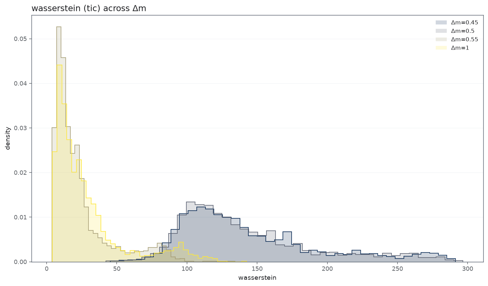
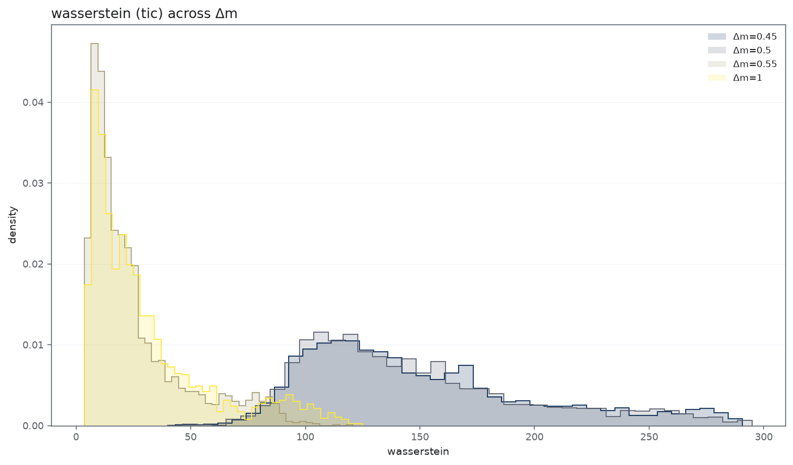
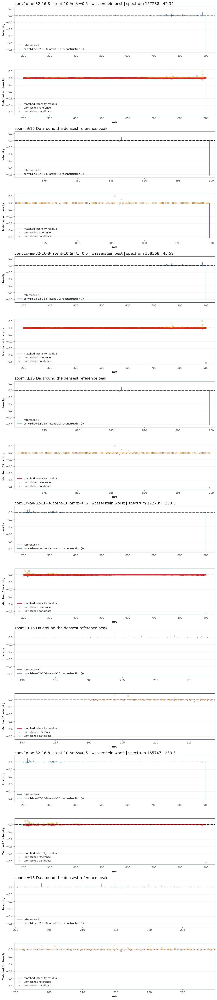
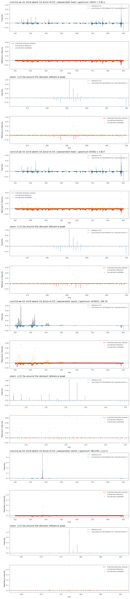
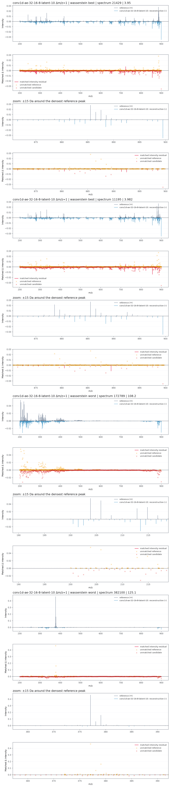
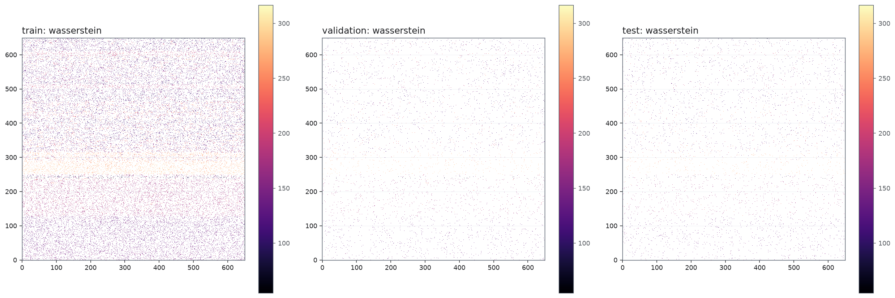

#### Wychwytywanie informacji przez model

##### Metryka Wasserstein

Rzeczy zwracałem uwage to rozkład błędu masserstein'a. Robiłem agregacje po wszystkich modelach oraz próbach. 

Dla binning o gęstości $\mathrm{\Delta m\backslash z} \in \{0.55 , 1.00\}$ otrzymujemy najjnnieszjy błąd. Gdzie wartości $0.55$ interpretuje jako największą gęstość, która umożliwia rekonstrukcje.  

**Wyniki na widmach treningowych**

<table border="1" class="dataframe">
  <thead>
    <tr style="text-align: right;">
      <th></th>
      <th>binning_step</th>
      <th>median</th>
      <th>q25</th>
      <th>q75</th>
      <th>mean</th>
      <th>mean_best_validation_loss</th>
    </tr>
  </thead>
  <tbody>
    <tr>
      <th>0</th>
      <td>0.45</td>
      <td>137.599299</td>
      <td>112.458401</td>
      <td>175.790405</td>
      <td>150.452779</td>
      <td>10.658020</td>
    </tr>
    <tr>
      <th>1</th>
      <td>0.50</td>
      <td>135.403355</td>
      <td>110.127662</td>
      <td>172.963968</td>
      <td>147.253900</td>
      <td>10.827485</td>
    </tr>
    <tr>
      <th>2</th>
      <td>0.55</td>
      <td>18.186949</td>
      <td>10.433244</td>
      <td>32.334864</td>
      <td>25.736556</td>
      <td>10.831900</td>
    </tr>
    <tr>
      <th>3</th>
      <td>1.00</td>
      <td>22.028723</td>
      <td>11.753285</td>
      <td>39.331893</td>
      <td>31.002073</td>
      <td>11.272218</td>
    </tr>
  </tbody>
</table>

**Wyniki na widmach testowych**

##### Kluczowe widma 

W przypadku sieci konwolucyjnej, możemy zaobserować że od gęstości $\mathrm{\Delta m\backslash z} \= 0.55$, model zaczyna **generować obwiednie**. W przypadku innych architektur tego nie obserwujemy. 

Moim zdaniem wynika to z tego, że uzywamy filtry któych używamy wymuszają przy rekonstrukcji działanie na kilka sąsiadujących wektorów bazowych, gdzie w przypadku MLP model próbuje znaleźć "punktową relacje". W przypadku mniejszych binningów. 

Widzimy, również, że obwiednie są za szerokie. Poprawiłem to w końcowym modelu, poprzez wymianę, rozmiarów filtrów, w późniejszej analizie, będzie można zobaczyć ten wynik. 

Wziąłem tylko widma testowe, ponieważ wyniki są analogiczne. 

**Wyniki na widmach testowych**

##### Globalna generalizacja

Żeby szybko porównać, czy błąd różni się pomiędzy pixelami znacząco, pokazałem po prostu heatmape z błędem. Zauważmy, że nie możemy wyróżnić żadnego obszaru gdzie błąd znacząco odstaje. 

