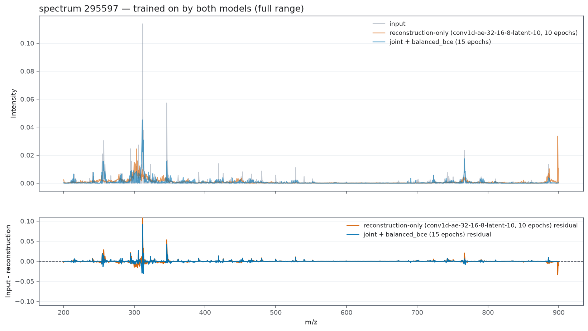
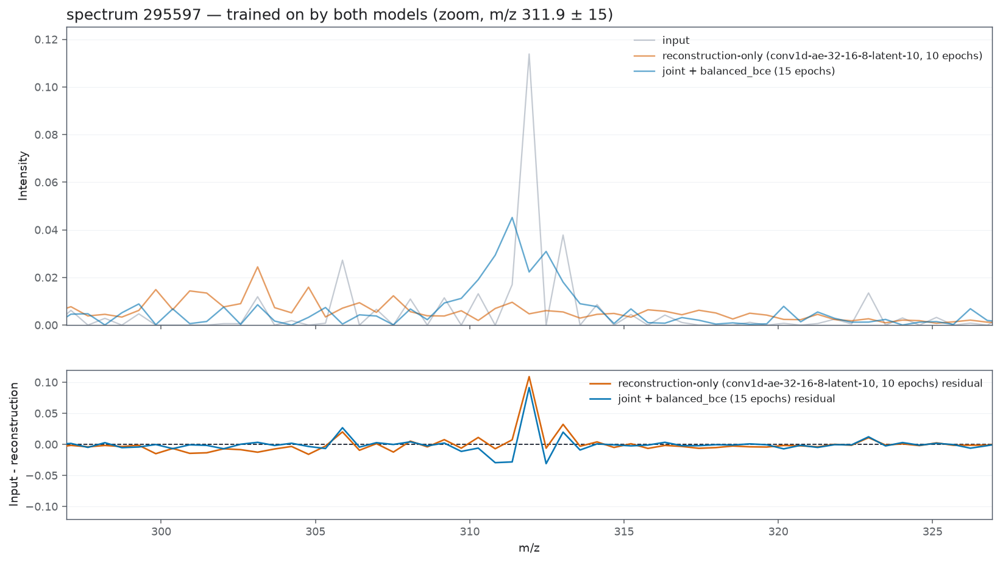
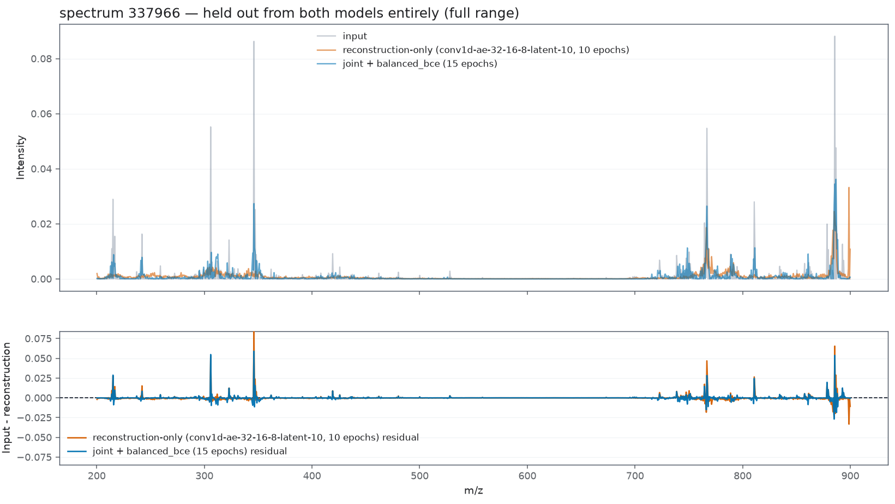
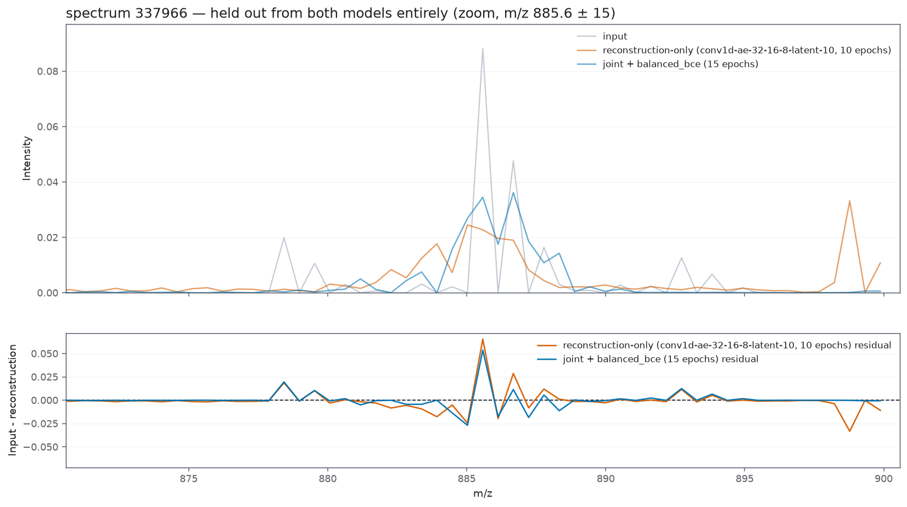
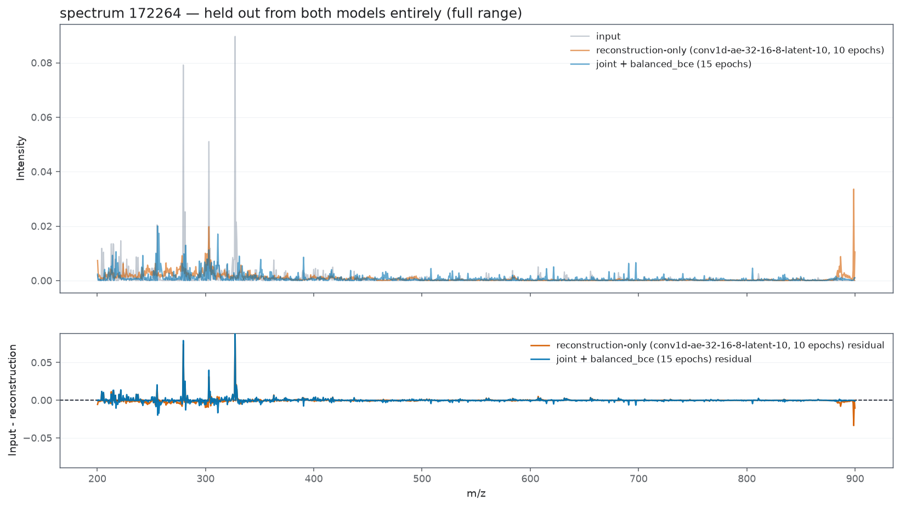
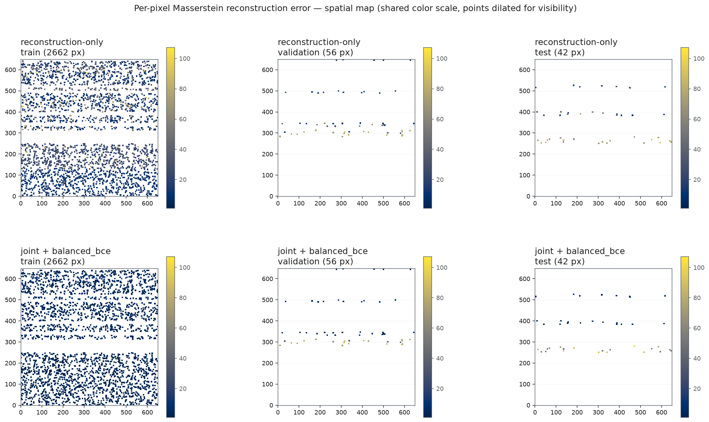
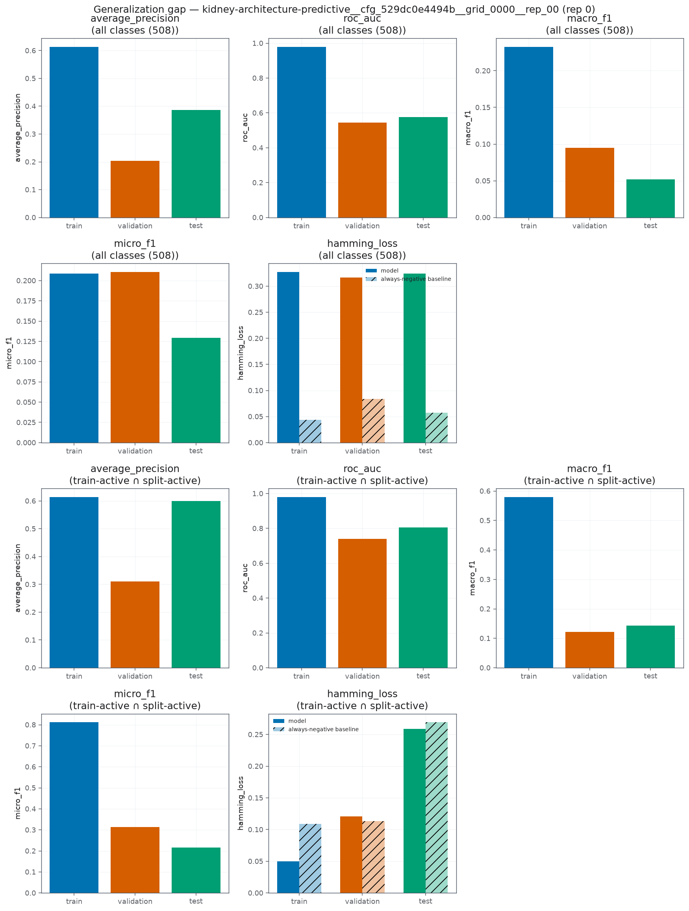
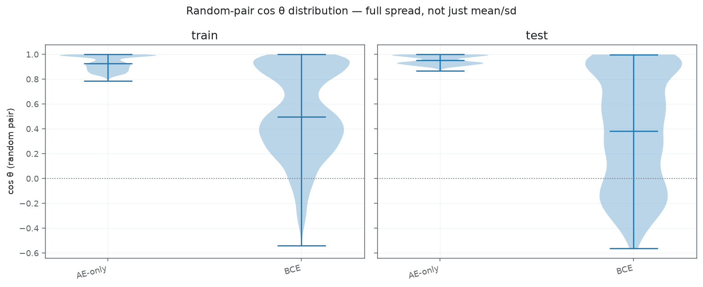
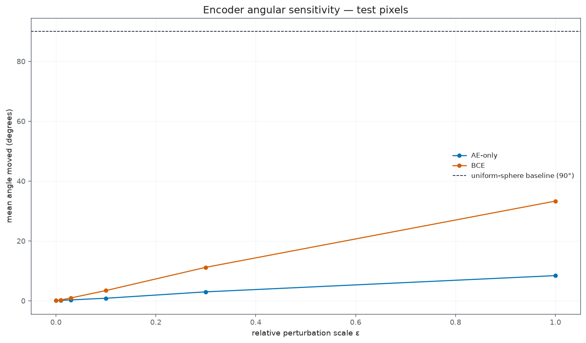

#### Rekonstrukcja widm

##### Wstępne porównanie modeli

Wstępne mozęmy zauważyć, że `bce` gorzej średnio się generalizuje. 

Jest to jednak bardzo mylne, ponieważ w `reconstruction_only`, **był błąd implementacyjny**, który polegał na tym, że output dekodera nei był normalizowanym, więc nie spełnione było założenie o sumie masy. Mogło to powodować zaniżenie błędu. Powodowało to również powstawanie charakterystycznego piku z na brzegu widma.  

##### Porównanie spektr 

Wybrałem tutaj wspólne widma w zbiorze treningowym i testowym. Możemy zauważyć że znazcna większość obwiedni jest dobrze rekonstruowana. tylko pojedyncze widma maja duży błąd. 

**Spektra treningowe**

**Spektra testowe**

##### Globalna rekonstrukcja 

Widzimy, że w obu przpyakdahc nei powstaja żande charakteryrsyczne oszaru złej predykcji. 

#### Predykcja

<!-- #TODO To raczej do metodologii tzreba przeniesć, jak przeniesiec to tutaj usuń  -->

Tutaj analiza jest trochę problematyczna, ponieważ źle zadeklarowałem klasy, i model uczył się także przewidywać te klase które **nie były obecne w zbiorze treningowym**. 

Zacieśniłem zatem zbiór tylko do tych obecnych w ziborze treingwoyhc. (wyniki są i tak zbiasowane ... :/ ) 

##### Generalizacja

<!-- #TODO - w metodolologii wytłuamcz działanie metryk, trzeba też napisać że skupiamy sie na przycji poniewaz większośc klas będzie pusta i to jest najsensowniejsza metryka -->

Widzimy że model nauizcył seina danych trenigowych, ale genearliazjac mu nie wychodzi. 

#### Przestrzeń ukryta

##### Rozkład punktów na sferze 

Widzimy, żę w przypadku dodania kryterium klasyfikacyjnego, model zaczyna używać pełengo zakresu przestrzeni.

##### Charakteryzacja wymiaru podrozmaitości

Warto zauważyc że dodają zadanie predykcyjne, znacząco zwiększa się wymiar podrozmaitości na której rozłożone są dane. 

<!-- #TODO - ja nie rozumiem do końca, jaka jest interpretacaj tego - to trzeb adokaldnie w metodoylogi opisac i wróce tutaj z wynikami.  -->

| Split | Model   | Trace    | Effective Rank | Participation Ratio |
|------:|----------|---------:|---------------:|--------------------:|
| Train | AE-only  | 0.734855 | 2.777075       | 1.898121            |
| Train | BCE      | 5.034307 | 4.529865       | 3.267879            |
| Test  | AE-only  | 0.463119 | 2.554138       | 1.992395            |
| Test  | BCE      | 6.027739 | 2.782806       | 2.001006            |

_spectrum.png)

| Split | Model   | Samples | Two-NN Intrinsic Dimension |
|------:|----------|--------:|---------------------------:|
| Train | AE-only  | 2662    | 5.991886                   |
| Train | BCE      | 2662    | 5.715953                   |
| Test  | AE-only  | 42      | 2.750988                   |
| Test  | BCE      | 42      | 2.957976                   |

##### Charakteryzacja otoczenia 

<!-- #TODO - to samo co wyżej  -->

| Split | Samples | Procrustes Distance | Linear CKA | k-NN Overlap | Trustworthiness | Continuity |
|------:|--------:|--------------------:|-----------:|-------------:|----------------:|-----------:|
| Train | 2662    | 0.400881            | 0.896602   | 0.415815     | 0.991466        | 0.990260   |
| Test  | 42      | 0.284460            | 0.966448   | 0.930952     | 0.991195        | 0.993351   |

##### Czułość enkodera na zaburzenia 

##### Relacja pomiędzy anotacji oraz strukturą geometryczną

| Split | Model   | Spearman's ρ | p-value        | Pairs |
|------:|----------|-------------:|---------------:|------:|
| Train | AE-only  | 0.655230     | 0.000000e+00   | 19991 |
| Train | BCE      | 0.544595     | 0.000000e+00   | 19993 |
| Test  | AE-only  | 0.645515     | 3.043454e-199  | 1685  |
| Test  | BCE      | 0.677485     | 1.659840e-226  | 1683  |
