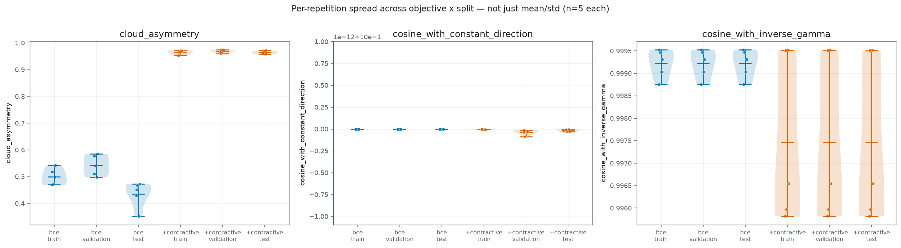
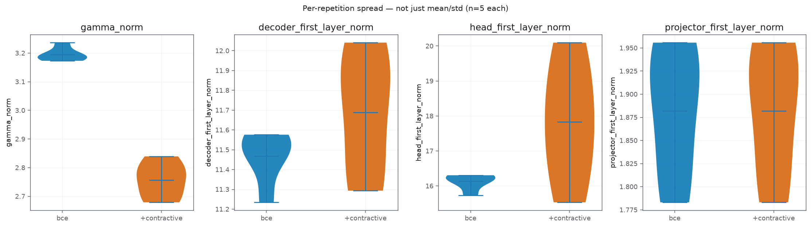
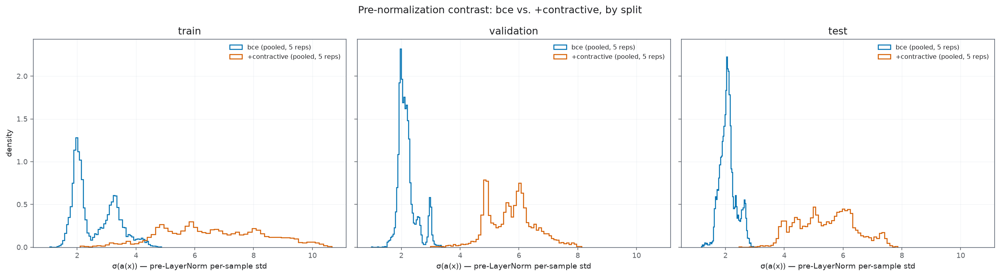
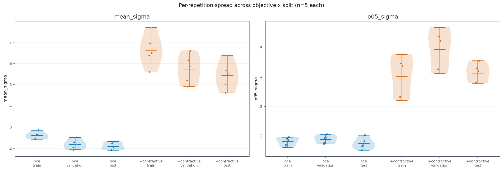
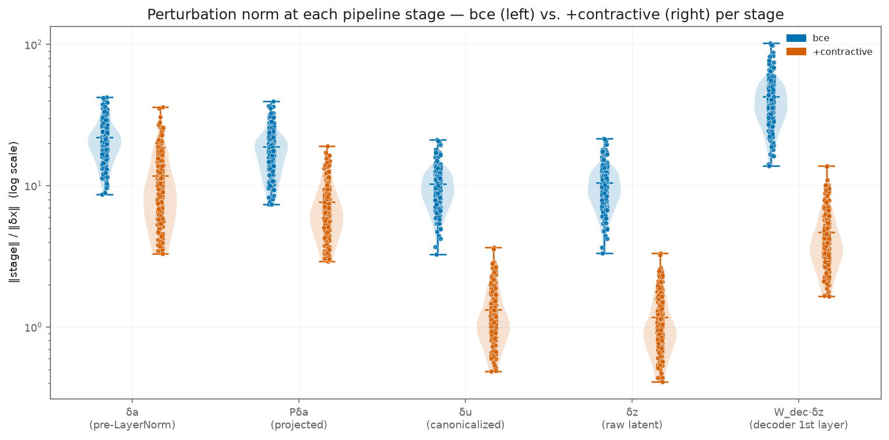
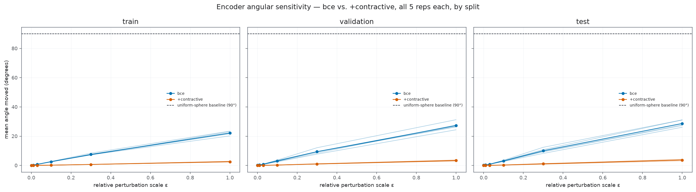
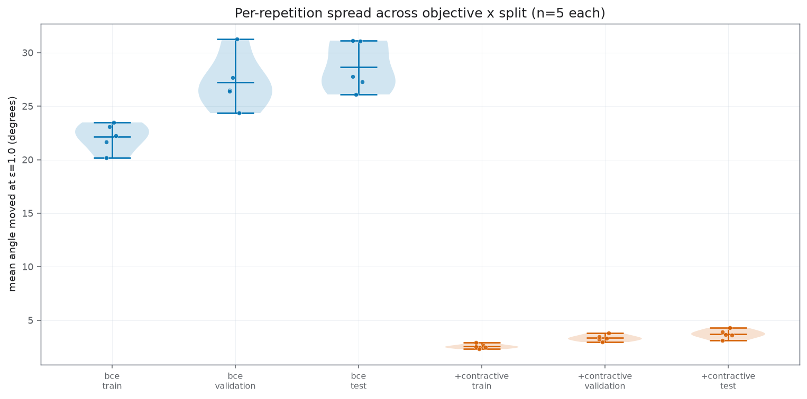
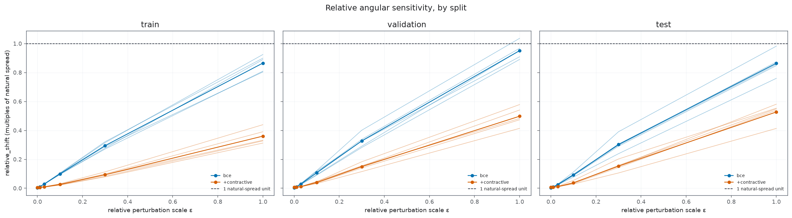
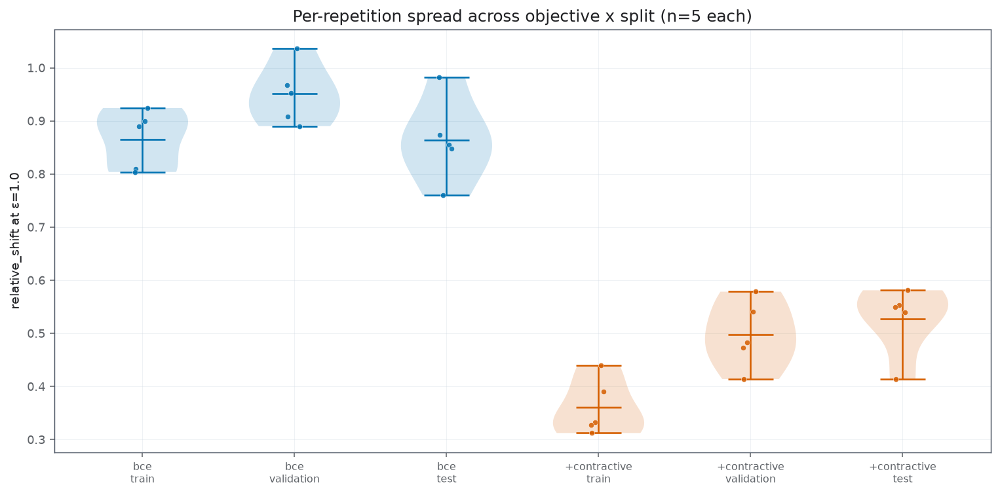
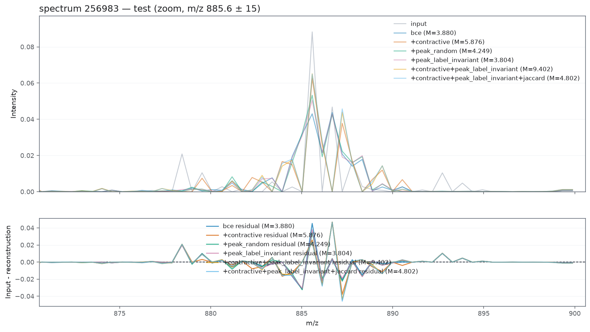

#### Wpływ na geometrie 

##### Asymetryczność 

#### Analiza poszczególnych statystyk

##### Parametr $\gamma$ 

##### Parametr $\sigma$ 

Z normy widzimy, że nie jest ona drastycznie zmieniona. 

 

##### Podsumowanie

Ostatecznie możemy stwierdzić że model **nie oszukuje kontrastywnej funkcji kosztu**. Ostatecznie można to stwierdzić, po tym jak zamienia się norma pertrubacji na każdym kroku. 

**Perturbacja w kazdym elemencie AE**

#### Odporność na perturbacje (najważniejsze) 

##### Wpływ na przestrzeń

Widzimy, żę kontraktywność zapewnia brak perturbacji, jeżeli chodzi o enkodowanie. Widzimy to i w przypadku bezwzględynym i relatywnym. 

Zatem model może używać znacznie mniej przestrzeni, jednocześnie zawierając całą informacje. 

##### Zasadność - wpływ na parestrezń.

Widzmy, że contrastywność w wieszości przypadków **nie jest konieczna**. W przypadku zwykłego BCE, juz widzimy że pertubacje jeżeli już miały by miejsce rzadko. 

W przypadku kontrastywnego, kazdy punkt jest przypisany **indywidualnie**, zatem każde widmo powiinno być **jednoznacznie przypisane**

##### Wykresy 

**Bezwzględne**

**Względne**

#### Rekonsturkcja 

W przypadku obserwacji otoczenia, możemy  zauważyć, że uczenie kontraktywne nnie wpuszcza takich amłych losowch warotści, jets to bardziej stabinle 

#### Podsumowanie 

**Możemy jednoznacznie stwierdzić, że kontrastywna funkcja kosztu działa**. To jest: 
- zapewnia unikalność mapowania
- zmiejsza rozłożenie w przestrzeniu 
- nie hakuje funkcji kosztu za pomocą zmiany wag w okreslonych parametrach.

