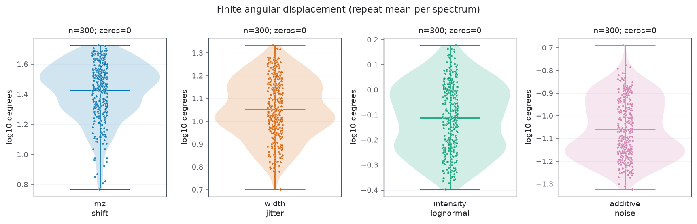
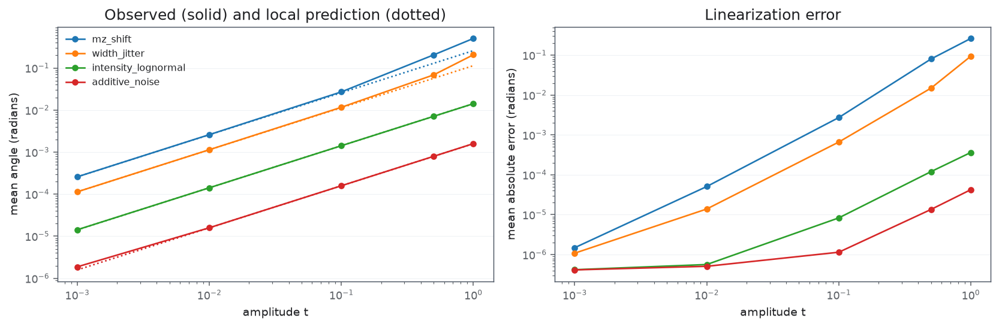
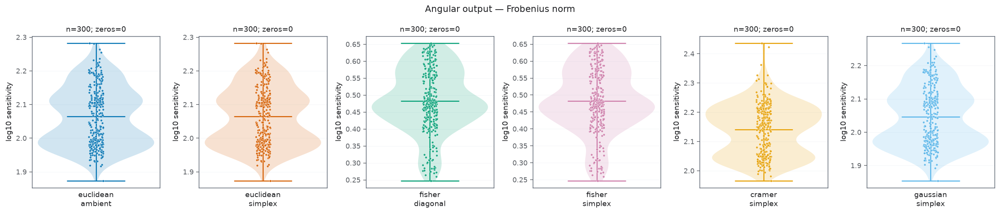
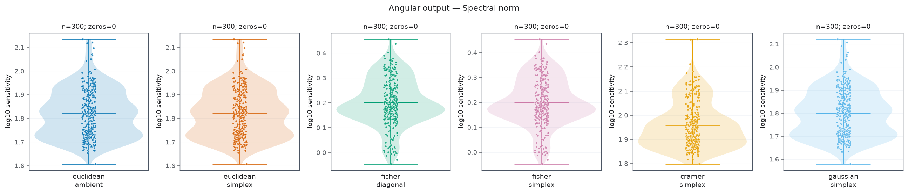
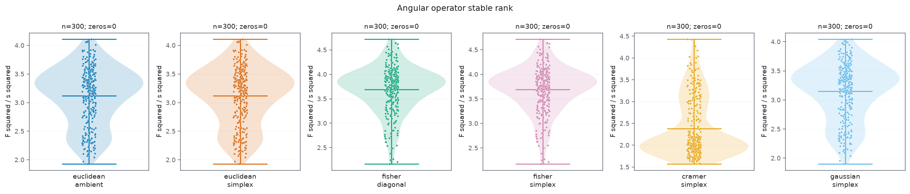
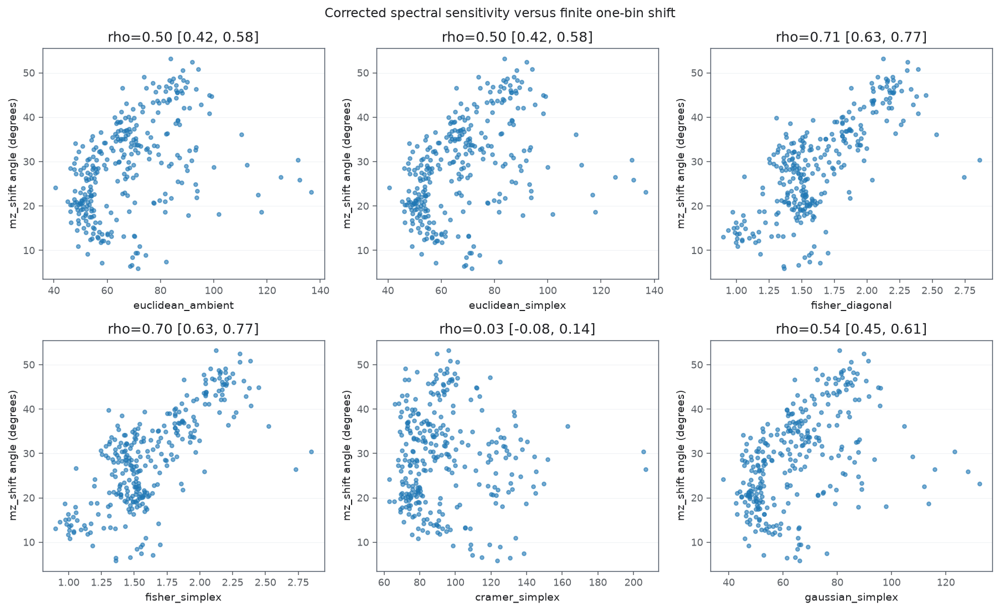
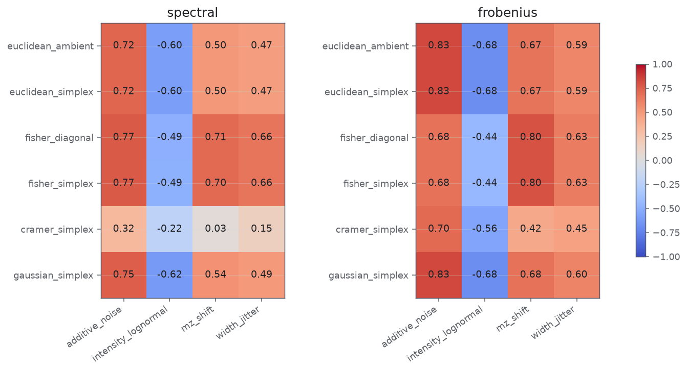
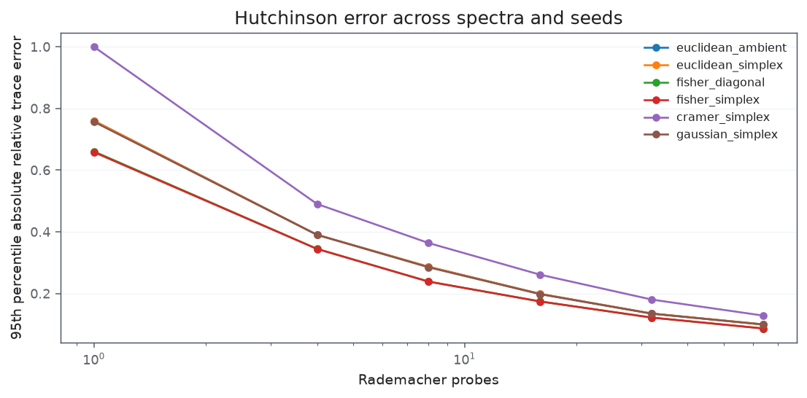

#### Charakteryzacja istotnosci zmian (??? chodzi mi o )

##### Wyznaczenie, które pertubracje najbardziej zmieniają kąt

Widzimy że na model najbardziej wpływa zaburzenie permutacji intensywności osi $\mathrm{m\backslash z}$, oraz rozmywanie widma (width jitter). 

> Uwaga:
> To jest ciekawa analiza na końcowy model, ponieważ daje nam interpretacje modelu. W tym przypadku trzeba by dokładniej rozpisać te skrajen przypadki i zobaczyć jak bardzo widma sie różnią. 

#### Porównanie zaburzenia względem metryki oraz normy 

##### Zmiana kąta

Fischer z norma spektralną wygląda obiecująco. 

Widzimy, istotnie różnice wpływu na kąt w przypadku stosowania róznych norm i metryk. W przypadku fischera widzimy że zmiana kąta jest "subtelniejsza", dla euklidesowej błąd skacze o bardzo duży kąt (losowy można by rzec). Tłumaczy to dlaczego odlełości kątowe były blisko zera, ponieważ cały kąt się za bardzo przesuwał. 

Ważne jest jeszzce żę w normie spektralne widzimy bardziej znaczącą zmianę dla fischera (1.6 stopnia), co jest sesnwonym zaburzeniem, ponieważ przesuwa widmo **minialnie** względem sfery, co może pozwolić na konstrukcje lokalnego otoczenia. 

##### Wykorzystywanie przestrzeni

Widzimy że zaburzenie generowane względem metryki Fischera przekłada się bardziej na zaburzenie kąta niż w przypadku metryki euklidesowej. To jest o pól wymiaru (to jest dużo) 

##### Wpływ zaburzenia na metrykę 

Widzimy, że fischer ewidetnie koreluje z przesniętym kątem, gdzie w przypadku metryki euklidesowej błąd jest widozny, ale nie widać czystego wzoru. 

Widzimy że w przypadku metryki Frobenisua i fischera model jest bardziej wrażliwy na kąt i bardziej wrażliwy na błąd addytywny.

W p[rzpyadku euclidean dostajemy słabsze wyniki ]

#### Analiza stabilnosci numerycznej (do innej analizy to dać)

Widzimy z analizy żr canonical i angular nie ma znaczneia, są identyczn. W przypadku estymacji błędu i próbek, najlepiej wychodzi 32. Koszt jest jeszcze mały przy hjednoczesnie znacznie zmniejszonym błędzie. 

#### Podsumowanie 

##### Ustawienie wrażliwości metryk dla Fischera

Z wykresu `Paierd spectral norm ratios` widzimy że w najgorszym przypadku ten rozrzut jest około $100$ większy. 