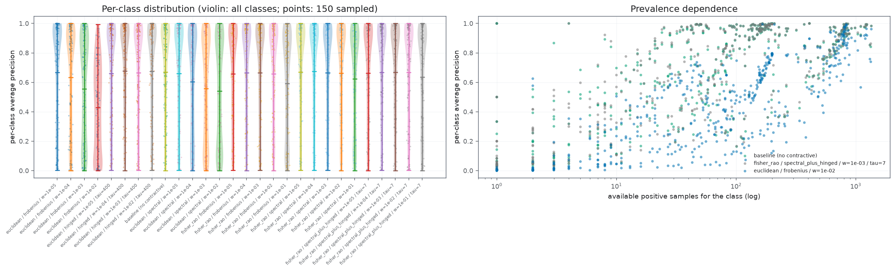
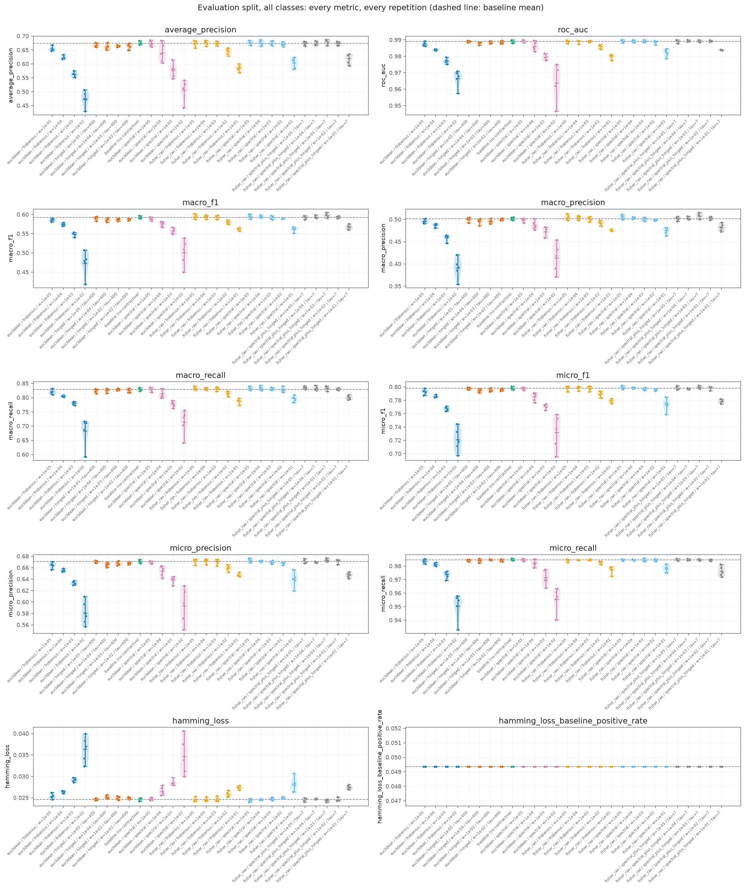
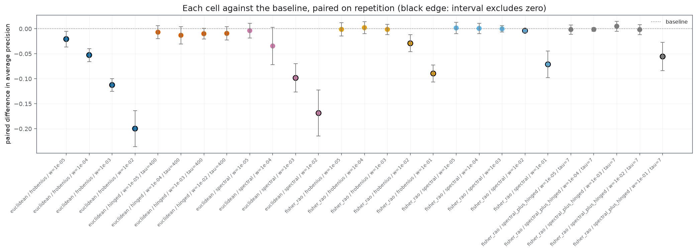
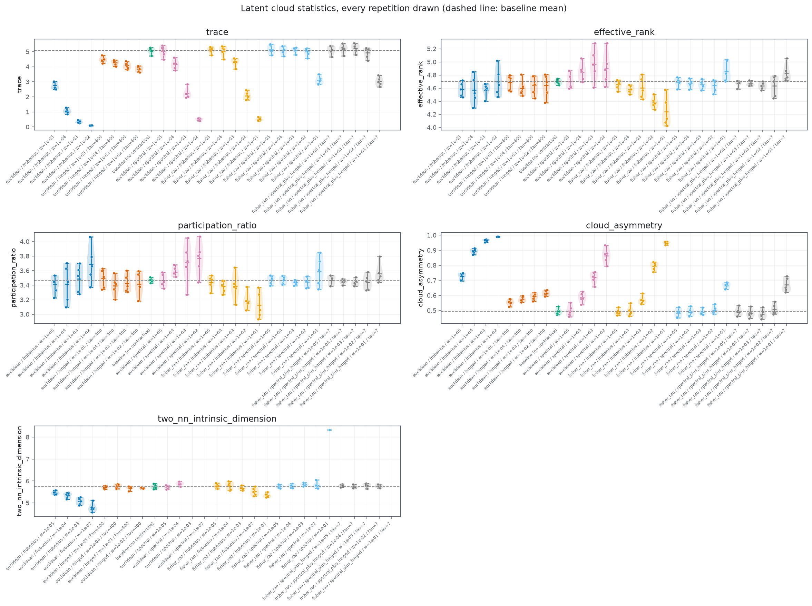
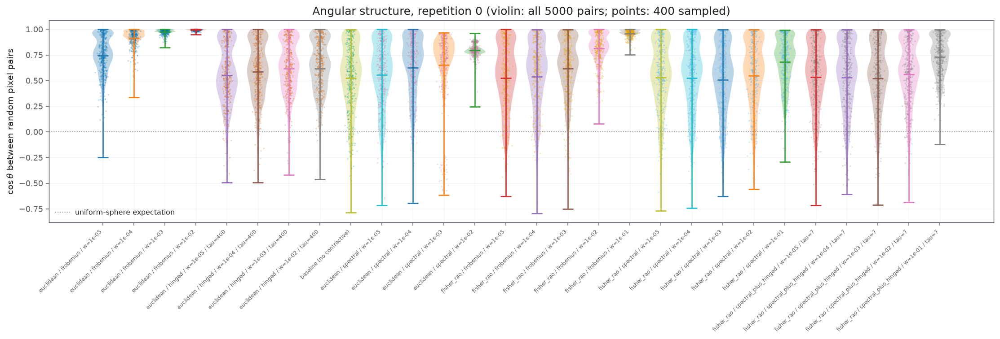
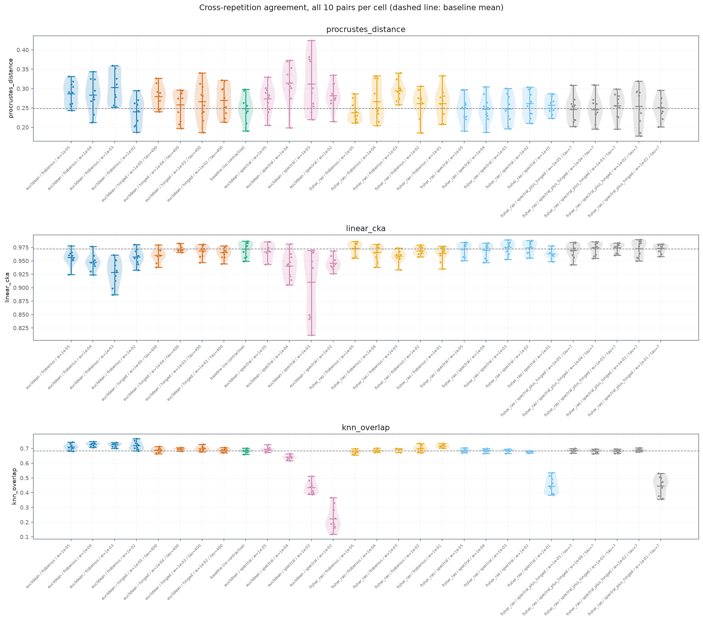
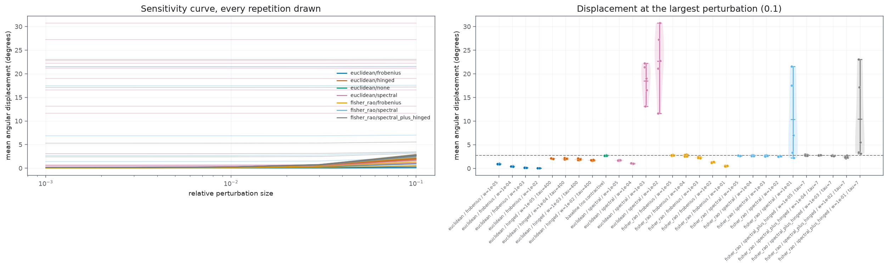

Analiza ta jest rozszerzeniem poprzedniej, wprowadzając nowe metryki projekcje itd. Wyniki są lepsze względem baseline'u

#### Charakteryzacja 

##### Rozkład błędów w klasach

Widzimy, że Średnia preyzja jest znacnzie lepiej rozłożona niż poprzednia. Widzmy też że większość błędnych predykcji wynika z klas kóter są mało liczne. 

Widzimy, że 

#### Predykcyjność 

##### Wszystkie metryki

ja bym wyróznił trzy modele, 
- `fischer_rao / frobenius w=1e-05`
- `fischer_rao / spectral w=1e-05`
- `fisher-rao / spectral-plus-hinged w=1e-3`

##### Porównanie z baselinem

Z wykresu widzimy żę minialnie popirawiły się wyniki dla fischer Rao (nadal zawierają zero) , najlepszy wynik daje model `fisher-rao / spectral-plus-hinged w=1e-3`

#### Geometria 

Będę głównie patrzył na wyróżnione z poprzedniego

##### Podstawowe statystyki przestrzeni ukrytej 

W rozpatrywanych modelach nie widać istotnej zmiany. Jest to dobre, poniewaz nie niszczy to rozkładu kątów, oraz jednocześnie zwiększa predykcje. Funkcja kosztu miała udopdornić na pertubacje, i zapewnić dobry rozkład w latencie. 

##### Reprodukowalność uczenia

Wszystkie analizowane metody są reprodukowalne w podobnym stopniu.

##### Różnica zaburzenia

Widzimy, że zaburzenie na rozważane metryki wpływa minimalnie, Euclidean jest na samej górze i tegujarlzyacje diząłaj trochę lepiej. 

#### Podsumowanie 

Ogólnie widać minimalą różnicę pomiędzy tymi konfiguracjami. Widzimy 